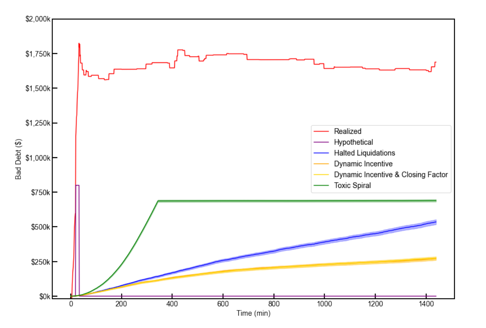
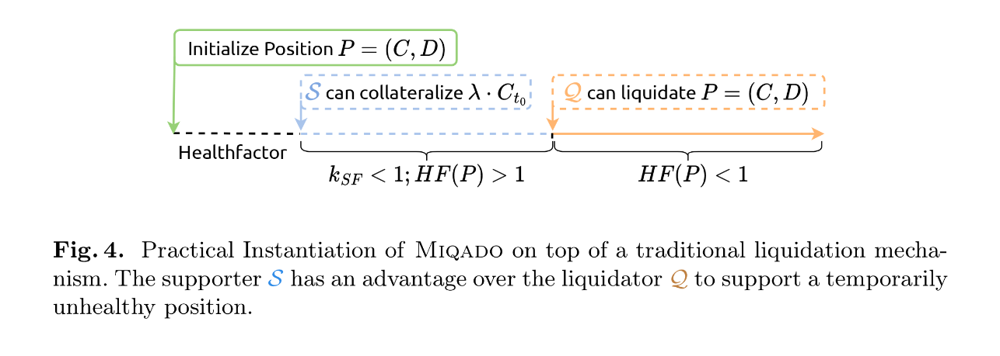
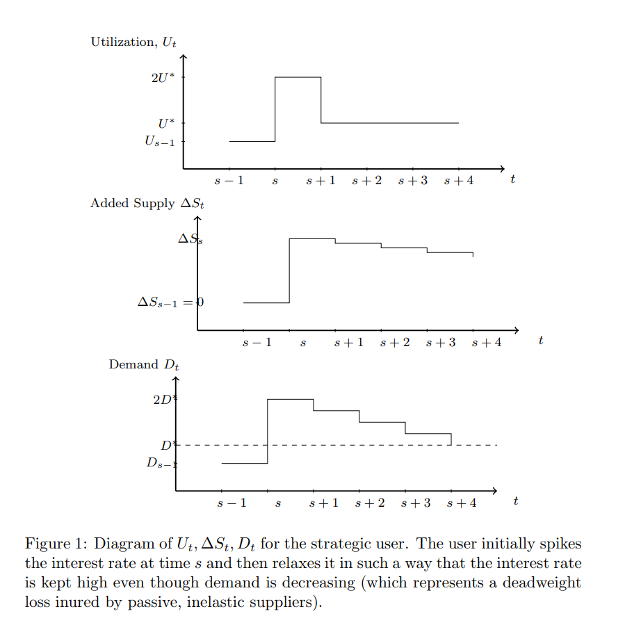
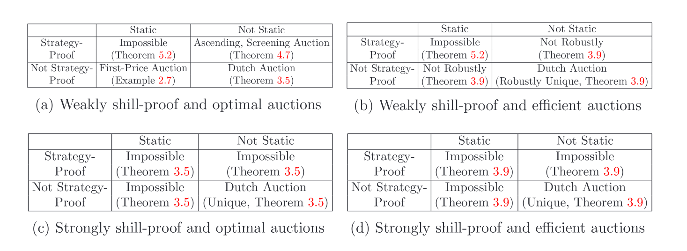

# DeFi Design Takeaways from DeFi Risk Modelling

Everyone involved in the rollout of a protocol has an interest in providing the best possible protocol design to end users. A user doesn't care if they lose value due to an arithmetic error or due to a bad design choice - the user's end result is the same. So while security experts are often focused on finding implementation errors in a protocol's design, this can miss the forest for the trees when the protocol implementation is perfect but the design is wrong or suboptimal.

With this in mind, it makes sense to learn what research and conclusions exist about optimal DeFi protocol designs. And although this makes sense, this post is likely the first time that a summary of DeFi economic modelling research has been presented to a smart contract security or developer audience. If you want to learn more about this topic, join and discuss in the [DeFi Economic Modelling research channel in the yAcademy Discord](https://discord.gg/a8JVZ6gF) or check out [this repository](https://github.com/engn33r/DeFi-Risk-Modelling-Awesome) which lists similar resources.

The whitepaper summaries below are not intended to replace reading the actual whitepapers, which are linked to in each header title. However, these summaries should make it easier to determine the core message of each paper which allows the reader to select which papers are most relevant to read for particular situations. One illustration is selected from each paper to highlight a key point presented.

## Paper 1: [Toxic Liquidation Spirals](https://arxiv.org/abs/2212.07306)

If you are going to read only one of these papers fully, it should be this one. This paper is relevant for any borrowing/lending protocol. It expands on an idea first mentioned in a “Counterproductive Incentives” high risk finding from a [2019 OpenZeppelin audit of Compound Finance](https://blog.openzeppelin.com/compound-audit) and examines real data from the November 2022 CRV bad debt attack on Aave by Avi Eisenberg. This paper describes how _every_ lending protocol with a liquidation incentive (Aave, Compound Finance, and all their forks) has a risk of accumulating bad debt. The paper demonstrates why this liquidation incentive poses a risk to lending protocols and examines how best to handle toxic liquidation spirals should they occur.

The chart below illustrates several different approaches that Aave could have taken to the November 2022 bad debt scenario assuming different protocol design choices. The worst case scenario in the chart is what actually happened (in red), while the other lines are alternative design choice solutions for the same scenario. The chart makes it clear that good design choices in extreme edge cases can have a real impact on keeping user funds safe.

## Paper 2: [Mitigating Decentralized Finance Liquidations with Reversible Call Options](https://eprint.iacr.org/2023/254)

Similar to the first paper, this paper proposes an alternate design to handle liquidations in lending protocols. The paper outlines the details of the proposed MIQADO mechanism, but in short, it incentivizes users to improve the health of unhealthy borrowing positions by adding collateral. The solution proposed is the use of "reversible call options" to replace existing liquidation mechanisms. The novelty of a "reversible call option" compared to a standard call option is that an extra outcome is possible: the seller can terminate the option contract at a premium before expiry. In a standard call option, only the buyer has control over how the option is exercised. Simulations with historic on-chain data demonstrate significant reductions in liquidations and therefore reduced risk of toxic liquidation spirals. While the idea of supporting unhealthy loans instead of liquidating them is an idea that hasn't been widely tested yet on-chain, the MIQADO solution does introduce a substantial increase of complexity for an on-chain implementation. The pricing of the reversible call option incentive involves many inputs, similar to [Black-Scholes](https://en.wikipedia.org/wiki/Black%E2%80%93Scholes_model).

The diagram below shows a possible implementation of MIQADO on top of an existing liquidation mechanism. When the health factor drops to an extreme level, the position can be liquidated as usual (orange color), but prior to that point, a supporter S receives an incentive (in the form of a reversible call option) to provide additional collateral to improve the health of the borrowing position (blue color).

## Paper 3: [Attacks on Dynamic DeFi Interest Rate Curves](https://arxiv.org/abs/2307.13139)

This paper is relevant for any protocol involving a dynamic control system, like a PID controller. It focuses on a specific example of dynamic control systems that can be gamed by users. As DeFi protocols continue to seek out greater capital efficiency, it is natural that some protocols will experiment with dynamic control systems. However, certain manipulation attacks can be performed against dynamic control systems. This paper examines weaknesses of an on-chain PID controller, specifically against a P and PI controller. The concept of attacks against dynamic control systems is not generalized, so there is room for future investigation into the implications of manipulating any system with [feedback control](https://en.wikipedia.org/wiki/Feedback) using [control theory](https://en.wikipedia.org/wiki/Control_theory). The paper also describes several mitigations that can make dynamic control system manipulation more expensive.

The chart below demonstrates an example of manipulating a proportionally controlled interest rate. The basic steps for a strategic user to manipulate the system are:

1. The strategic user increases demand at time s to increase utilization rates.
2. The strategic user deposits assets to increase supply while decreasing demand. This is done in a way to keep the interest rate high.
3. The attacker can return the utilization to the same level prior to time s, but with more deposited assets in the protocol. This causes the attacker to receive "extra" yield on their increased supply at the expense of other "inactive" lenders.

## Paper 4: [Shill-Proof Auctions](https://arxiv.org/abs/2404.00475)

This paper is relevant for any protocol involving an auction. While certain parts of DeFi are known to be more vulnerable to manipulation than others (low liquidity meme coins, for example), there has not been a wider discussion around the risks involved in auctions like NFT auctions. This paper starts by highlighting that well-known auction houses like Christie's and the website eBay have rules about shill bidders (roughly defined as bids made by the seller to boost the price) and then examines shill-proof auction formats. In summary, Dutch auctions are the only strongly shill-proof auction format while English auctions are only weakly shill-proof.

The chart below shows whether an auction is efficient (whether the auction winner is the real bidder with the highest valuation), whether an auction format is strategy-proof, or whether an auction format is strongly or weakly shill-proof. Dutch auctions are a better choice based on these specific criteria and I would expect to see greater adoption of this auction format once these results are shared more broadly.

## Paper 5: [Automated Market Making and Loss-Versus-Rebalancing](https://arxiv.org/abs/2208.06046)

Last but not least, this excellent paper is relevant for any protocol (or users) that are liquidity providers to an AMM. In a similar way to how the pricing of options was most famously quantified with the Black-Scholes model, this paper provides a "Black-Scholes for AMMs" equation. The key term is the "loss-versus-rebalancing" (LVR) performance gap, which is the difference between a "rebalancing strategy" that replicates the AMM trades at market prices in a CEX (this assumes a CEX with infinite liquidity, so trades have no price impact) compared to holding a LP position. A comparison of the two strategies shows that holding the LP position returns a worse result due to price slippage on each trade. It is therefore in the interest of AMM designers to reduce this LVR gap as much as possible to improve capital efficiency.

Of particular interest to DeFi natives is section 8 discussing the differences between "impermanent loss" (termed "loss-versus-holding" (LVH) in the paper) and LVR. Differences include:

- LVH and LVR are strictly non-negative values, but LVH can revert (return to zero) while LVR is strictly increasing
- LVH depends on the initial pool position at time t = 0. Two LPs will realize different and unrelated LVH if they did not deposit at times when the pool had identical holdings. In comparison, all LPs experience the same LVR over the same time period.
- LVH is path independent while LVR is path dependent

A final remark in this section addresses the common assumption that there is no impermanent losses if prices return to their original levels. This is debunked because while that assumption may be true for the rebalancing strategy (with swaps made in a CEX with infinite liquidity), swaps in the AMM experiencing price slippage and result in LVR, leading to a worse result.

The key equation in this paper is the LVR equation. LVR is dependent on the variables of volatility (`σ`), asset price (`P`), value of the pool (`x∗'(P)`), and time (`t`).

## Conclusion

The field that I call DeFi Risk Modelling is so new that it doesn’t have a clear and distinct name yet (Tokenomics Research? DeFi Economics?), so the implications of these papers are not as well-known to the protocol developer and security ecosystem as they should be. But as protocols increase in complexity and interconnectedness, it becomes more important to understand the side effects from each design decision and how different variables in a protocol relate to one another. Progress in protocol design can happen much faster if supported by strong fundamentals and good design, as opposed to choosing suboptimal decisions without thorough analysis.

In the future, I hope to see more and more protocols sharing economic analysis _at the start of the contract security code review_ in order for the implications of certain protocol design decisions to be better understood when the code is getting a close examination. If a complex new protocol does not do robust modelling under a wide variety of extreme market conditions, unknown unknowns can hide in the protocol's design until it's too late.

## Acknowledgements

Thanks to Daniele Pinna and Jakub Warmuz, experts in this space who have patiently answered my questions and provided insights from the economics perspective.
