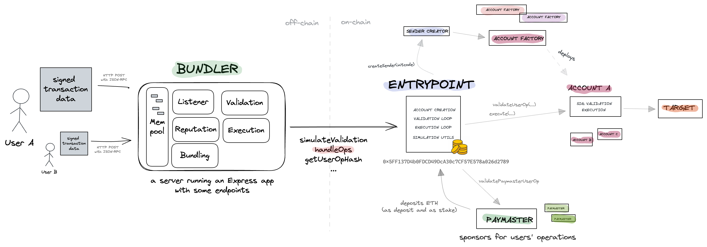
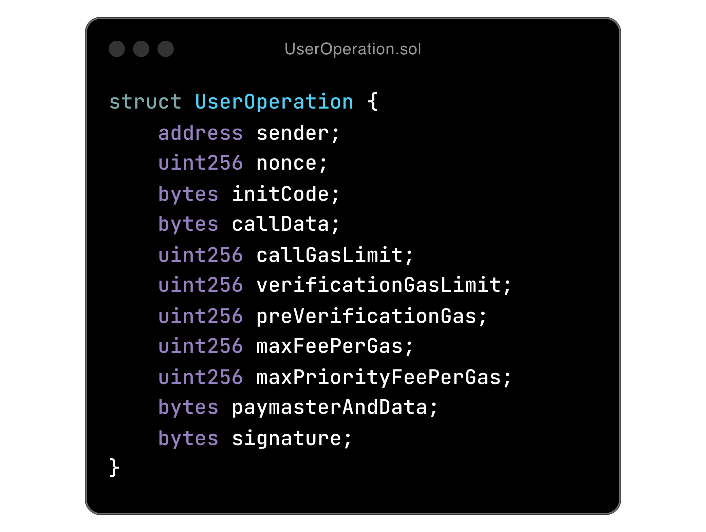
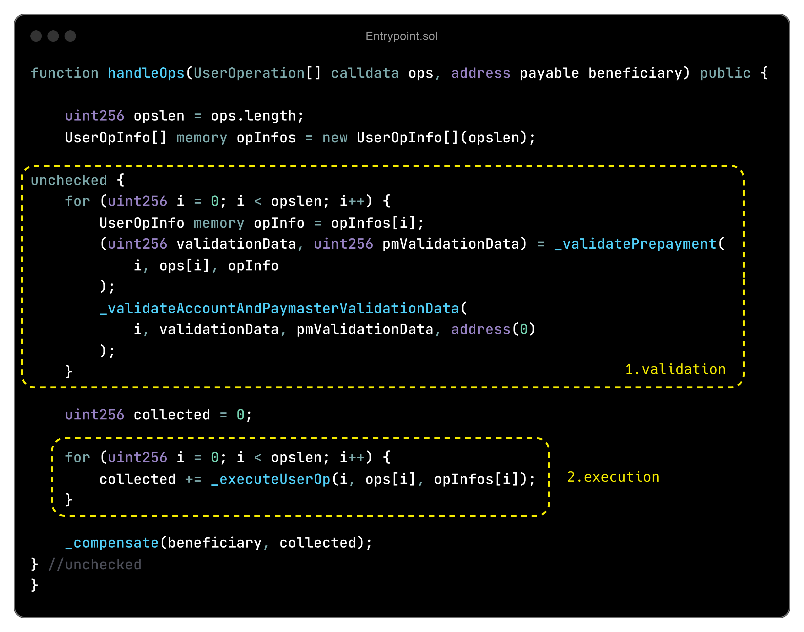
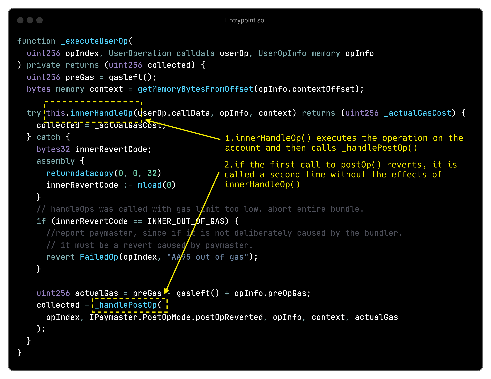

# Security notes on ERC4337 and smart wallets

## Account abstraction

Account abstraction is an extensive topic, but at a very high level, the idea is to abstract the concept of an account into a smart contract (the _smart wallet_) that allows a lot more flexibility than an EOA (externally owned account) which most people use today while interacting with the blockchain. Among some of the benefits are:

- Improved security: implement [social recovery](https://vitalik.ca/general/2021/01/11/recovery.html) in case access is lost. Authorization keys can be rotated without the need to move assets.
- Sponsored transactions: the user doesn't need to have ETH, third-party entities (called paymasters) can sponsor transaction fees.
- Alternate signing methods: a smart wallet can specify any signing protocol.
- Gas efficiency: multiple actions can be batched in a single transaction to improve gas costs.

Once decoupled from the limitations of an EOA, the flexibility of an account is just bounded by what can be programmed in a smart contract.

## The standard

The proposed standard to implement account abstraction in Ethereum is defined in [EIP-4337](https://eips.ethereum.org/EIPS/eip-4337).

<figure class="mt-5">
    <figcaption style="text-align:center"><small>This is probably the best diagram depicting ERC-4337 out there, kudos to <a href="https://theredguild.org/" target="_blank">The Red Guild</a>.</small></figcaption>
</figure>

### Actions

Actions are represented by objects called user operations.

A detailed explanation of each can be found [here](https://eips.ethereum.org/EIPS/eip-4337#entrypoint-definition), but we can see some familiar names that are also part of Ethereum transactions: `sender`, `nonce`, `callData`, `gasFees` (packs `maxFeePerGas` and `maxPriorityFeePerGas`). The signature attribute is an arbitrary payload that will be used by the wallet implementation.

### Bundlers

Bundlers run a server that collect user operations in an alternate mempool. They are responsible for executing the actions, which are eventually packed into a batch of user operations and sent to the Entrypoint.

Bundlers pay for gas, but expect to have their costs reimbursed, plus a fee for their service.

### Entrypoint

The _Entrypoint_ is the central on-chain actor. It is a singleton smart contract that is trusted by the other parties, and will handle the interaction between the bundler, account, and paymaster to coordinate the validation and execution of an operation.

### Factory and accounts

Factories are responsible for creating the actual accounts. If the account is not yet deployed, the user operation can include an `initCode` that will be used to initialize the contract through a factory.

Contract creation leverages the `CREATE2` opcode to provide deterministic addresses. This helps mimic the behavior of an EOA: the sender address can be safely precomputed without the need to deploy code beforehand.

The account contract will typically be created during the first interaction.

### Paymaster

One key feature of the standard is the ability to sponsor transactions. Paymasters, another entity defined in the ecosystem, can provide the required funds to cover the costs of an operation. This can greatly help onboard new users and improve the overall experience, and has been one of the [dominating](https://www.bundlebear.com/paymasters/all) use cases for account abstraction.

For example, a specific protocol might sponsor transactions to its contracts to incentivize interaction. Another useful scenario would be a paymaster pulling ERC20 tokens from the account as payment, enabling gasless transactions.

## Security Notes

As the proposal states, the main challenge is safety against denial-of-service (DoS) attacks. While certain on-chain interactions are straightforward to validate (e.g. checking a signature is valid), ensuring that a builder who is willing to execute an (untrusted) operation gets reimbursed is not. What happens if an attacker includes operations that intentionally revert? We can add validations, but who pays for gas costs spent on validations? What if it is the bundler who intentionally griefs users? Operations can be simulated off-chain, but how can we make sure those have the same outcome when run on-chain?

On top of that, imagine what would happen if bundlers interface directly with the account. The bundler can’t trust the account will pay back the fees, and the account can’t trust the bundler won’t be sending invalid operations that can’t be executed but will cost gas (and will have to pay for).

The solution to this problem is to separate validation from execution. This approach allows us to apply rigorous constraints in the validation phase without interfering with the actions of the operation itself. The two major limitations are:

- Ban certain opcodes that can be used to retrieve information from the environment (e.g. `TIMESTAMP`, `NUMBER` or `GASPRICE`, full list available in EIP-7562 section [_Opcode Rules_](https://eips.ethereum.org/EIPS/eip-7562#opcode-rules)).
- Restrict access to storage in order to prevent a future mutation from interfering with the outcome of an operation.

The key here is to make the step validation as pure as possible, in hope that its off-chain simulation can accurately predict what will happen on-chain. The bundler should only care for the validation of the operation. Any gas paid for an invalid operation will be attributed to the bundler, but failed operations (once authorized) are paid by the sender. This way the bundler can run simulations on the validation step, increasing the confidence that its on-chain execution will be successful.

The separation of validation and execution is the main reason for having a central Entrypoint. We can impose restrictions on the validation step while later allowing arbitrary execution. Running operations through the Entrypoint provides better guarantees to the bundler and allows the account to safely decouple validation from execution (remember that the Entrypoint is a trusted entity).

In short, the Entrypoint does the following:

1. Validation step. For each operation:
   - Validate account has enough funds to cover for the maximum amount of gas
   - Validate operation in account (`validateUserOp()`)
2. Execution step. For each operation:
   - Execute operation and track gas costs
3. Send fees back to the bundler

We can clerly see this pattern in the [reference implementation](https://github.com/eth-infinitism/account-abstraction/blob/04ee30e3130dc1145ad7032318cf841909a8bc71/contracts/core/EntryPoint.sol#L90-L110):

Note how the loop works here: validations are done all together in a separate loop. We don't want the execution of an operation to interfere with the validation of another.

Having a central Entrypoint contract orchestrating the process is what allows the different actors to verify that others are behaving correctly. Upon execution, the account just needs to check the caller is the Entrypoint as it can trust the Entrypoint has previously validated the operation. Splitting validation and execution wouldn’t be possible without this trusted entity.

<figure>
    <figcaption style="text-align:center">
      <small class="mx-auto d-block w-75">
        Account execution simply checks the caller is the Entrypoint, as it can trust the operation has been previously validated. Example from <a href="https://github.com/eth-infinitism/account-abstraction/blob/04ee30e3130dc1145ad7032318cf841909a8bc71/contracts/samples/SimpleAccount.sol#L67-L70" target="_blank">SimpleAccount.sol</a>.
      </small>
    </figcaption>
</figure>

The same conflict arises when a paymaster is involved and we need to call `validatePaymasterOp()` to check if the paymaster is willing to sponsor the operation. However, the situation here is a bit different. A single paymaster may be handling multiple user operations from different senders, which means that potentially the validation from one operation may interfere with another since the paymaster’s storage is shared between all the operations in the bundle that have that paymaster in common. Restricting storage access in this function would be quite limiting, and that would severely reduce the capabilities of what a paymaster can do (see EIP-7562 section [_Unstaked Paymasters Reputation Rules_](https://eips.ethereum.org/EIPS/eip-7562#unstaked-paymasters-reputation-rules)).

Malicious paymasters can then cause a denial-of-service. To mitigate this attack vector, the standard proposes a staking and reputation system. Paymasters are required to stake ETH. Bundlers also track failed validations and can throttle or directly ban an uncooperative paymaster. Note that staking is **never slashed**. The purpose of staking is to mitigate sybil attacks so that a paymaster cannot simply move to a new account with a fresh reputation.

An important detail is that paymasters are also allowed to execute after the main operation is completed by calling `postOp()`. During the validation phase, the paymaster can check certain conditions are met before the operation executes, but that may easily be invalidated during execution. For example, a paymaster that pulls ERC20 tokens to cover the costs can validate that the sender has enough tokens (and enough approval), but the execution of the operation can intentionally or accidentally change that. A failed call to `postOp()` could revert the operation, but at this point gas has been consumed and that would be charged to the paymaster, enabling griefing attacks by a malicious account.

The solution to this problem is quite interesting due to its simplicity, we call the paymaster’s `postOp()` twice. The first call happens in the inner context along with the main execution of the operation. If this first call reverts, then the operation is also reverted, and a second call gets triggered, now with the effects of the operation nullified.

Factories not only enable deterministic deployment but also offer stronger guarantees to the various actors. Rather than dealing with a shallow string of bytecode, the existence of a concrete and known factory allows better visibility and analysis, while providing additional security. For example, a paymaster can decide whether to sponsor the wallet creation by simply checking the target factory. For bundlers, the complexity of the simulation is greatly reduced by having a well-known implementation that ensures no on-chain reverts. Additionally, it provides better security for users, as a factory contract address is easier to analyze than an arbitrary initialization code, enabling better tooling and user experience.

<figure>
    <figcaption style="text-align:center">
      <small class="mx-auto d-block w-75">
        Account are created in the validation phase using a factory. Snippet from <a href="https://github.com/eth-infinitism/account-abstraction/blob/04ee30e3130dc1145ad7032318cf841909a8bc71/contracts/core/SenderCreator.sol#L15-L27" target="_blank">SenderCreator.sol</a>.
      </small>
    </figcaption>
</figure>

Because wallet deployment is essentially decoupled from the desired authorized account, it is important to link the wallet initialization with its address, as properly [noted by the standard](https://eips.ethereum.org/EIPS/eip-4337#first-time-account-creation). Otherwise, an attacker could eventually deploy a wallet with their credentials. This is usually implemented by relating the signature with the creation parameters (which could be the salt or the init code hash). Thus, changing the authorized account would then result in a different address.

Since account creation is also part of the validation phase (we need to have it deployed before we can validate the operation on the account), factories have the same conditions as paymasters. They must either be staked, or restrict its storage space to the wallet’s domain.

## Known implementation issues

### Destroy wallet implementation

Factories typically use the clone pattern to deploy new wallets. They have an instance of the implementation, and create proxies pointing to this implementation. If anyone can take over the implementation instance and destroy it, that would render all proxies unusable, bricking all wallets. This has been mitigated by the [deprecation of selfdestruct](https://eips.ethereum.org/EIPS/eip-6049) but still can be exploited in other chains.

- [EIP4337Manager selfdestruct issue](https://taekdev.notion.site/eth-infinitism-account-abstraction-0-4-0-EIP4337Manager-selfdestruct-issue-d4ed6daa511c4152a365298217dca0f6)
- [Destruction of the SmartAccount implementation](https://github.com/code-423n4/2023-01-biconomy-findings/issues/496)
- [AmbireAccount implementation can be destroyed by privileges](https://github.com/code-423n4/2023-05-ambire-findings/issues/10)

### Gas

Gas plays a crucial role in the system, it is key to ensure successful operation execution and adequate compensation. Proper gas tracking is a difficult task due to the numerous rules governing its usage, which can lead to many potential pitfalls.

Attacker intentionally inflates size of data to increase fees.

- [Theft of funds under relaying the transaction](https://github.com/code-423n4/2023-01-biconomy-findings/issues/489)

Malicious bundler griefs operation execution by providing insufficient gas. Even when the user operation specifies the gas limit, if the running context doesn’t have enough gas it will still execute the call using the available amount.

- [DoS of user operations and loss of user transaction fee due to insufficient gas value submission by malicious bundler](https://github.com/code-423n4/2023-01-biconomy-findings/issues/303)

### Incorrect wallet initialization

As discussed previously, it is important to relate the address of a wallet to its ownership, else anyone could deploy and maliciously initialize it.

- [Attacker can gain control of counterfactual wallet](https://github.com/code-423n4/2023-01-biconomy-findings/issues/460)

### Signatures

Signature issues deserve a dedicated article on their own, but many of the common problems can be also seen in the account abstraction schema.

- Wallet fails to verify contract signatures
  - [Arbitrary transactions possible due to insufficient signature validation](https://github.com/code-423n4/2023-01-biconomy-findings/issues/175)
  - [SmartAccount authorization can be bypassed using a contract signature](https://github.com/code-423n4/2023-01-biconomy-findings/issues/449)
- Paymaster signature can be replayed
  - [Arbitrary transactions possible due to insufficient signature validation](https://github.com/code-423n4/2023-01-biconomy-findings/issues/151)
  - [ERC4337 Sample VerifyingPaymaster Signature Replay attack](https://taekdev.notion.site/ERC4337-Sample-VerifyingPaymaster-Signature-Replay-attack-56335dc2cd3b45caa3fb5e96b82db7af)
- Parameter malleability caused by not being part of the signed data
  - [`tokenGasPriceFactor` in `FeeRefund` struct can be malleable in calls to execTransaction](https://github.com/code-423n4/2023-01-biconomy-findings/issues/447)
  - [Module type argument is malleable in Module Enable Mode flow](https://codehawks.cyfrin.io/c/2024-07-biconomy/s/128)
- Signature replay attack due to invalid nonce check.
  - [Replay attack (EIP712 signed transaction)](https://github.com/code-423n4/2023-01-biconomy-findings/issues/36)
  - [Missing nonce in `_getEnableModeDataHash()` allows signature replay](https://codehawks.cyfrin.io/c/2024-07-biconomy/s/202)
- Cross chain replay
  - [Cross-Chain Signature Replay Attack](https://github.com/code-423n4/2023-01-biconomy-findings/issues/466)
- Transaction replay due to not incrementing the nonce in all execution paths
  - [Recovery transaction can be replayed after a cancellation](https://github.com/code-423n4/2023-05-ambire-findings/issues/16)
- ERC1271 replay using different accounts with the same owner. The article includes a good discussion of who bears the responsibility for the validation.
  - [ERC1271 Replay](https://mirror.xyz/curiousapple.eth/pFqAdW2LiJ-6S4sg_u1z08k4vK6BCJ33LcyXpnNb8yU)
- Incorrect EIP-712 signature
  - [Typehash for ModuleEnableMode struct is incorrect](https://codehawks.cyfrin.io/c/2024-07-biconomy/s/131)

### Griefing

The slightest incorrect assumption could create a window to negatively impact an actor of the system.

In the following issue, an attacker can front-run the call to `handleOps()` to execute at least one of the bundled operations, causing the original batch to revert.

- [Griefing attacks on `handleOps` and `multiSend` logic](https://github.com/code-423n4/2023-01-biconomy-findings/issues/499)

Optional calls can be forced to fail by abusing EIP-150. In this next issue, the executor can intentionally supply less gas in order to revert the inner call, while still having enough gas in the outer context to complete the transaction.

- [Attacker can force the failure of transactions that use `tryCatch`](https://github.com/code-423n4/2023-05-ambire-findings/issues/18)

### Failure to comply with the standard

The standard is quite dense and non-trivial to implement. Adhering to all the nuances can be a difficult task.

- [Non-compliance with EIP-4337](https://github.com/code-423n4/2023-01-biconomy-findings/issues/498)
- [Protocol not fully compliant with `EIP-7579`](https://codehawks.cyfrin.io/c/2024-07-biconomy/s/200)

### Incorrect validations

Incorrect validations are not an exception when it comes to this subject. In this issue, the Entrypoint is not allowed to execute operations on the wallet, completely breaking the account abstraction integration

- [Methods used by EntryPoint has `onlyOwner` modifier](https://github.com/code-423n4/2023-01-biconomy-findings/issues/390)
- [Anyone can call the fallbackFunction because of missing authorization control](https://codehawks.cyfrin.io/c/2024-07-biconomy/s/42)

## References

- [https://eips.ethereum.org/EIPS/eip-4337](https://eips.ethereum.org/EIPS/eip-4337)
- [https://eips.ethereum.org/EIPS/eip-7562](https://eips.ethereum.org/EIPS/eip-7562)
- [https://github.com/eth-infinitism/account-abstraction](https://github.com/eth-infinitism/account-abstraction)
- [https://www.alchemy.com/blog/account-abstraction](https://www.alchemy.com/blog/account-abstraction)
- [https://www.youtube.com/watch?v=f-W6O0tIm2Y](https://www.youtube.com/watch?v=f-W6O0tIm2Y) (spanish content)
- [https://code4rena.com/reports/2023-01-biconomy](https://code4rena.com/reports/2023-01-biconomy)
- [https://code4rena.com/reports/2023-05-ambire](https://code4rena.com/reports/2023-05-ambire)
- [https://codehawks.cyfrin.io/c/2024-07-biconomy/results](https://codehawks.cyfrin.io/c/2024-07-biconomy/results?t=report)
