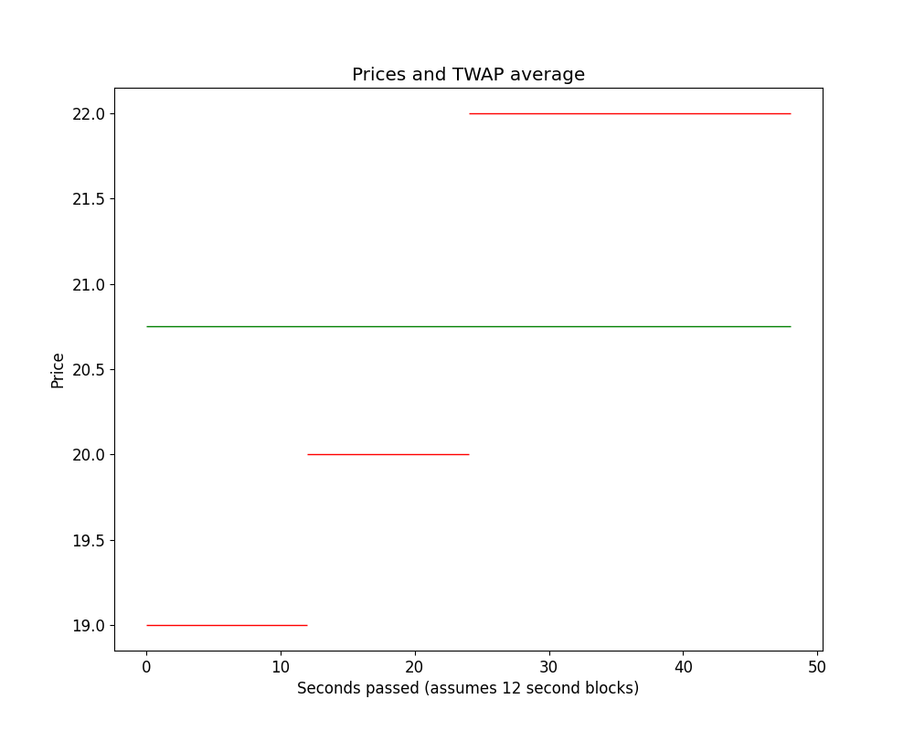
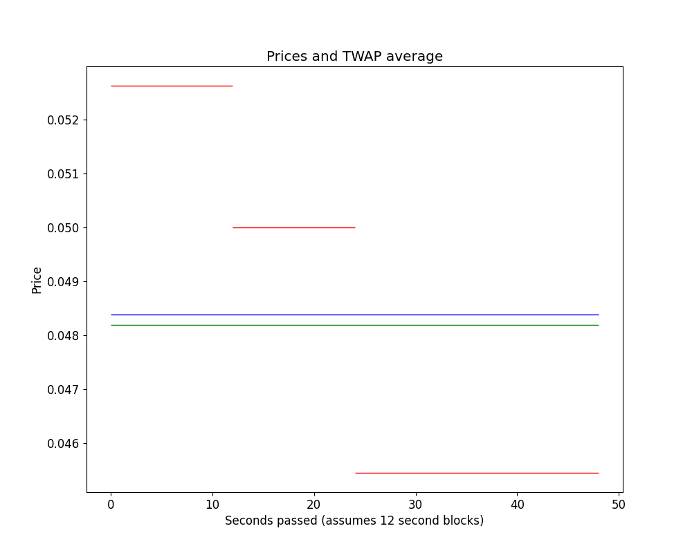
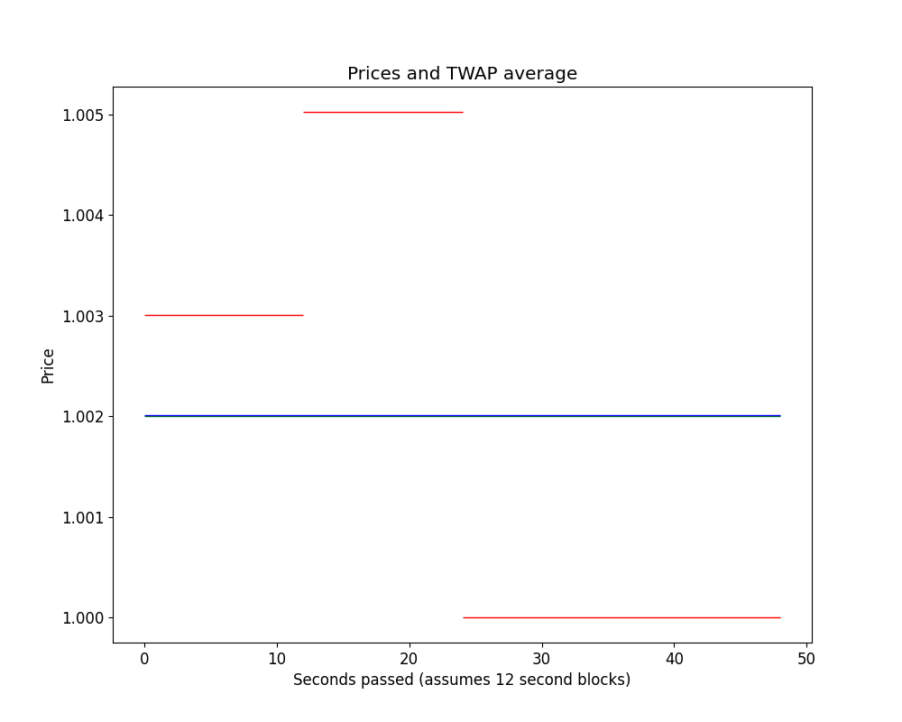
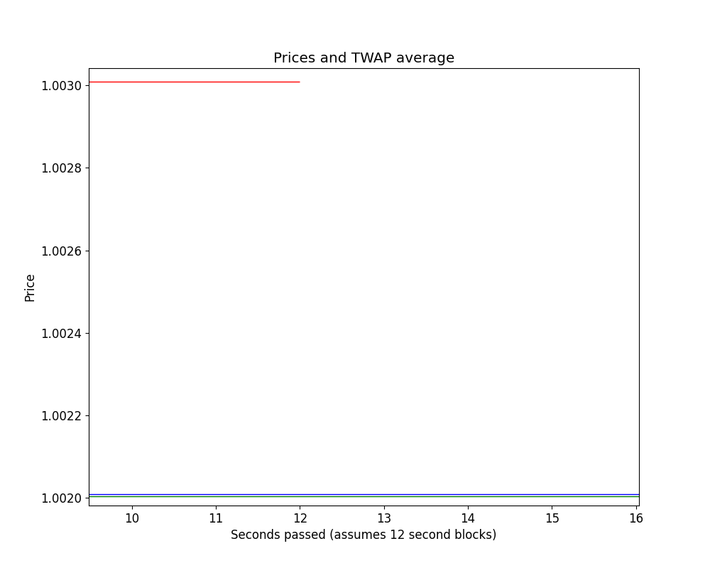
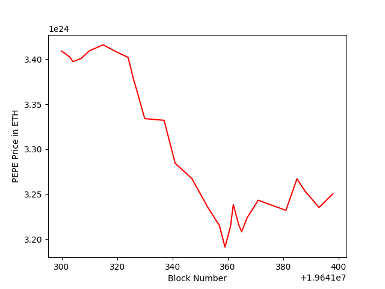
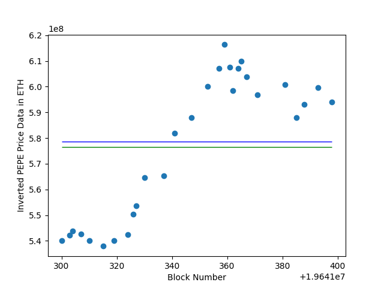

# Are Inverse TWAP Prices Inaccurate?

Time-weighted average price (TWAP) oracles are considered an alternative to off-chain oracles for certain use cases. However, incorrectly using the inverse of the TWAP can result in some inaccuracy. This article examines when this is a problem and the scale of inaccuracy that may be encountered with real-world market data.

While Ethereum's switch from PoW to PoS after The Merge introduces increased risk of manipulation for lower liquidity TWAP oracles, as acknowledged in [this post](https://blog.uniswap.org/uniswap-v3-oracles) by Uniswap, price manipulations are not the focus of this article.

## Averaging Math Behind TWAPs

At the core of any TWAP is some form of averaging. The math involved in this averaging is what creates a problem when the inverse of the average is needed. The core idea is that for a set of different values, the inverse of an average value is not equal to the average of the inverse values. This issue is demonstrated in the simplest form as follows. Consider the average price of a data set where the price of an asset is 2 and then 3:

$$ 
{2+3\over2} = 2.5 
$$

Now consider that an inverse average price is needed for swapping assets in the opposite direction from this original average price. The inverse of this average price can be calculated in two different ways. One way, and the easier "lazy" approach, is to take the inverse of the average price we calculate above. A more rigorous approach is to first take the inverse of the price at each point in time and then take the average of these inverses. The two approaches yield different results:

$$ 
\text { inverse of average price } \stackrel{?}{=} \text { average of inverse prices } 
$$

$$ 
{2\over2+3} \stackrel{?}{=} { {1\over2} + {1\over3} \over 2 } 
$$

$$ 
0.4 \ne 0.416666 
$$

Following the same logic, we continue with this equation format but now in the context of averaging on-chain prices. Consider the scenario of a highly volatile token with a price of around $20. Assume the block duration is fixed at 12 seconds, so each price has the same weighting of 12 (TWAP refers to "time-weighted" prices, after all). The Uniswap v2 TWAP would store the cumulative price as:

$$ 
(19*12) + (20*12) + (22*12) + (22*12) = 996 
$$

And the average price over this period can be calculated with:

$$ 
TWAP = {(19*12) + (20*12) + (22*12) + (22*12) \over (12+12+12+12)} = 20.75 
$$

This price action and the average can be seen in this chart. The red lines indicate the price during each block and the green line indicates the average price over the blocks. All the code to generate these example charts is included in [this repository](https://github.com/YAcademy-Residents/Inverse-TWAP-plots).



Now consider the case of an inverse TWAP that stored the inverse price at each point in time. This would be the exchange rate in the opposite direction, when swapping a USD-based stablecoin for the token. The inverse TWAP would store:

$$ 
{12\over19} + {12\over20} + {12\over22} + {12\over22} = 2.322488038 
$$

And the average of the inverse price over this period can be calculated with:

$$ 
TWAP = { {12\over19} + {12\over20} + {12\over22} + {12\over22} \over 12+12+12+12 } = 0.048385167 
$$

The inverse TWAP result can be compared with the inverse value of the original TWAP output to find:

$$ 
{1 \over 20.75} = 0.048192771 \ne 0.048385167 
$$

The inverse price data and the average inverse price can be seen in this chart. Similar to the previous chart, the red lines indicate the inverse price during each block. The blue line indicates the average of the inverse price TWAP (the more accurate average) while the green line shows the inverse price of the standard TWAP (the less accurate average).



There is a roughly 0.4% difference between using an inverse TWAP and inverting the result of a standard TWAP in this example. This large of a difference can have noticeable impacts for certain use cases. However, this demonstration of the core issue used example numbers rather than real on-chain data.

## Impact of Volatility

When considering the real-world inaccuracy when using an inverse TWAP price, volatility plays a large factor. Let's consider some basic examples that illustrate this intuitively:

- If a stablecoin remains stable at exactly \$1 for a long period of time, the average price is \$1 and the inverse is also \$1
- The averaging math that creates a delta between the price of an inverse TWAP and the inverse result of a standard TWAP is due to the variation in price data across time. More volatile assets have a greater variation in price data over time relative to total value, so the delta should be expected to be larger for more volatile assets.

An example of the difference in the inverse TWAP price and the inverse standard TWAP price is demonstrated with some hypothetical example numbers from a low volatility stablecoin. The price is at .997 for one block, .995 for the 2nd block, and 1 for the 3rd and 4th blocks. The delta between the inverse TWAP price and the inverse of the standard TWAP is only around 0.0004%. Even though Python is drawing a blue line and a green line, they overlap so only one color is visible in the first plot. Only after zooming in, in the second plot, are the two lines (barely) distinct.





But instead of using made-up data sets to examine the impact of inverting a standard TWAP, examining real-world price data will provide a more useful takeaway. But first, let's examine actual TWAP data sources in existing protocols.

## How TWAP Data Gets Stored

The Uniswap v2 documentation is so clear that the easiest way to explain how the Uniswap v2 TWAP mathematics works is by sharing this illustration from [their docs](https://docs.uniswap.org/contracts/v2/concepts/core-concepts/oracles).


The data is stored in the variables `price0CumulativeLast` and `price1CumulativeLast` with [this code](https://github.com/Uniswap/v2-core/blob/ee547b17853e71ed4e0101ccfd52e70d5acded58/contracts/UniswapV2Pair.sol#L76-L80).

```solidity
uint32 timeElapsed = blockTimestamp - blockTimestampLast;
...
price0CumulativeLast += uint(UQ112x112.encode(_reserve1).uqdiv(_reserve0)) * timeElapsed;
price1CumulativeLast += uint(UQ112x112.encode(_reserve0).uqdiv(_reserve1)) * timeElapsed;
```

The [Uniswap v3 TWAP docs](https://docs.uniswap.org/sdk/v3/guides/advanced/price-oracle) are slightly less clear than the v2 docs, which may be because the protocol is more complex overall. The [approach used in Uniswap v3](https://github.com/Uniswap/v3-core/blob/d8b1c635c275d2a9450bd6a78f3fa2484fef73eb/contracts/libraries/Oracle.sol#L36-L42) is very similar to Uniswap v2, but the tick value is used instead of the pool price. Storing the tick instead of the price means that the Uniswap v3 TWAP stores [the geometric mean](https://www.youtube.com/watch?v=XwPkXAeIppk), instead of the arithmetic mean of Uniswap v2.

```solidity
uint32 delta = blockTimestamp - last.blockTimestamp;
...
tickCumulative: last.tickCumulative + int56(tick) * delta,
secondsPerLiquidityCumulativeX128: last.secondsPerLiquidityCumulativeX128 +
    ((uint160(delta) << 128) / (liquidity > 0 ? liquidity : 1)),
```

Uniswap v4 doesn't include a comparable oracle at all. Instead, [the whitepaper](https://github.com/Uniswap/v4-core/blob/main/docs/whitepaper-v4.pdf) indicates this is left as an exercise for ~~the reader~~ hook authors by stating:

> the introduction of hooks makes the protocol-enshrined price oracle that was included in Uniswap v2 and Uniswap v3 unnecessary, which also means some pools could forgo the oracle altogether and save around 15k gas on the first swap on a pool in each block.

Uniswap does provide an example of a [truncated oracle hook](https://blog.uniswap.org/uniswap-v4-truncated-oracle-hook), but how hooks in Uniswap v4 will play out in practice once deployed on-chain remains to be seen.

## Protocol TWAP Design Differences

You may have noticed in the previous code snippet that Uniswap v2 actually has 2 different variables for storing TWAP data while Uniswap v3 has only 1 variable to store TWAP data. The reason why Uniswap v2 stores two different cumulative prices is the same reason that this article exists - the inverse of standard TWAP average price is not the same as the average price of an inverse TWAP. The [Uniswap v2 whitepaper](https://docs.uniswap.org/whitepaper.pdf) contains the following:

> One complication: should we measure the price of asset A in terms of asset B, or the price of asset B in terms of asset A? While the spot price of A in terms of B is always the reciprocal of the spot price of B in terms of A, the mean price of asset A in terms of asset B over a particular period of time is not equal to the reciprocal of the mean price of asset B in terms of asset A. For example, if the USD/ETH price is 100 in block 1 and 300 in block 2, the average USD/ETH price will be 200 USD/ETH, but the average ETH/USD price will be 1/150 ETH/USD. Since the contract cannot know which of the two assets users would want to use as the unit of account, Uniswap v2 tracks both prices.

Despite Uniswap v2 focusing on these details in TWAP design, Uniswap v3 only stores one TWAP price instead of two different TWAP prices. Another difference is that the Uniswap v3 TWAP [only stores historic tick data](https://docs.uniswap.org/sdk/v3/guides/advanced/price-oracle#calculating-the-average-price). So what impact do these decisions have for Uniswap v3?

The first key difference is that Uniswap v3 TWAP stores the _geometric mean_ while Uniswap v2 stores the _arithmetic mean_. The issue highlighted in the Uniswap v2 whitepaper, where the inverse of an average value is not equal to the average of the inverse values, is only relevant for the _arithmetic mean_. Consider this brief example of the geometric mean:

$$
\text { inverse of geometric mean price } \stackrel{?}{=} \text { geometric mean of inverse prices }
$$

$$
{1\over\sqrt{2*3}} \stackrel{?}{=} \sqrt{ {1\over2} * {1\over3} }
$$

$$
0.4082482904638631 = 0.4082482904638631
$$

This explains why Uniswap v3 does not store two separate values like Uniswap v2 does. However, be mindful that the A in TWAP for Uniswap v2 and Uniswap v3 means something different. In Uniswap v2, average means arithmetic mean, while in Uniswap v3, average means geometric mean. Whether one average is better than the other is out of scope of this article.

The other choice made by Uniswap, storing the tick instead of the price, is slightly less ideal. [Uniswap v3 documentation states](https://blog.uniswap.org/uniswap-v3-math-primer#how-does-tick-and-tick-spacing-relate-to-sqrtpricex96) that the tick data is not as accurate as the actual current price. While liquidity can only be added into tick ranges, which is a set of 10 ticks in a 5 bps pool, the price data can use individual ticks. The actual precision of these ticks is roughly 0.01%, which relates to the fact that 1.0001 is the exponent base used for tick math. Naturally, this 0.01% precision loss is a greater dollar figure for more valuable tokens. Consider the difference between one tick at different prices of the WETH/USDC pool:

$$
\text{Price at tick 196700} - \text{Price at tick 196701} = \frac{1}{1.0001^{196700} \cdot 10^{-12}} - \frac{1}{1.0001^{196701} \cdot 10^{-12}}
$$

$$
= 0.2869532935787902 \text{ (roughly 0.01 percent delta)}
$$

In summary, the TWAP value in Uniswap v3 can be inverted without the problems involved with inverting an arithmetic mean, but there is a consistent (though minor) pricing inaccuracy due to storing less precise ticks. On the other hand, Uniswap v2 costs more gas to use and therefore Uniswap v2 pools may get updated less often than Uniswap v3 by arbitrageurs, which could decrease price data accuracy in Uniswap v2.

## Visualizing On-Chain Data

To achieve our goal of understanding what the higher end of this price inaccuracy looks like, we examine the PEPE token as an example of a higher volatility token. This visualizing exercise will use on-chain price data from the PEPE/ETH Uniswap v3 pool on mainnet at [0x11950d141ecb863f01007add7d1a342041227b58](https://info.uniswap.org/#/pools/0x11950d141ecb863f01007add7d1a342041227b58) but use Uniswap v2 arithmetic mean math for comparing the inverse of an average value to the average of the inverse values. While this is mixing Uniswap v2 and v3, it was easier to gather the data this way.

A period of high volatility was chosen by manually looking at the PEPE/ETH price chart to identify blocks 19641300 to 19641400 as having a particularly rapid price change (about a 12% price drop). The chart of the price data is shown below.



Next, the inverse of each price data point was calculated and graphed. Also in the graph is the inverse of the standard TWAP average (green) and the average of the inverse TWAP (blue). The delta between the two averages is roughly 0.35%, which is not far from the 0.4% inaccuracy calculated with example data previously. The individual steps used to collect this data are listed after the chart.



Data collection steps:

1. Check price graph to identify a highly volatile period
2. Identify the block numbers that align to this time period (manual effort)
3. Pull price data into a CSV with sothis: `sothis --mode fast_track --source_rpc http://127.0.0.1:3000 --contract_address 0x11950d141ecb863f01007add7d1a342041227b58 --storage_slot 0 --origin_block 19641300 --terminal_block 19641400 --filename pepe-eth-price-data.json`
4. Plot the data to check that it was pulled properly. Remember the -csv flag to generate a CSV file of the data: `python3 plotter.py -i pepe-eth-price-data.json -l 12 -c data.csv`
5. Import data.csv to your favorite spreadsheet software to start slicing and dicing the data. Add any necessary columns with calculations. The end goal is to calculate the inverse of the standard TWAP across this set of data and compare it to the inverse TWAP average.
6. Plot the data using python and cleaned data in a csv data

## Conclusion

The main lesson here is that properly handling on-chain price data is hard. It may seem logical to invert any ETH/USDC price to get a USDC/ETH price, but the devil is in the details. There are common pitfalls when using any price source, and this article demonstrated one incorrect approach to handling TWAP data. When average price data is involved, it must be determined whether arithmetic mean or geometric mean is used when calculating the average. Furthermore, Uniswap v2 and Uniswap v3 differ on this point in how they collect TWAP data. While this article focused on one small edge case using price data, it did not closely examine [simple moving average (SMA) or exponential moving average (EMA)](https://docs.uniswap.org/contracts/v2/guides/smart-contract-integration/building-an-oracle#moving-averages) oracles in detail, nor were price manipulation risks of TWAPs examined.
