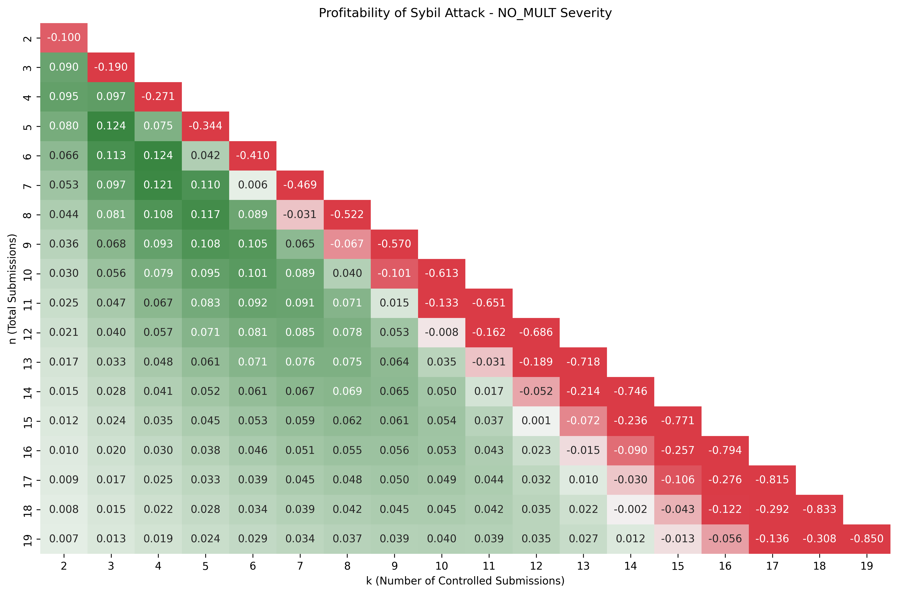
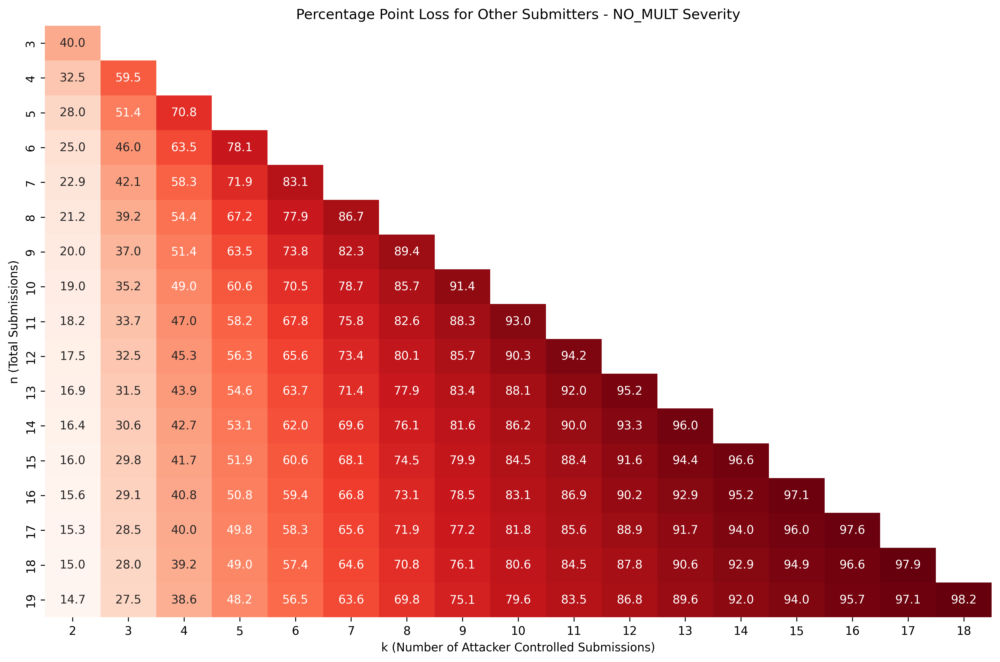
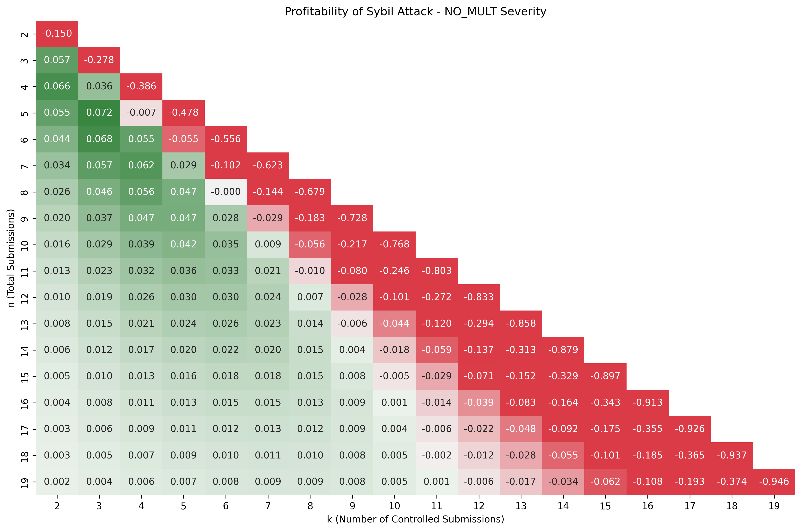
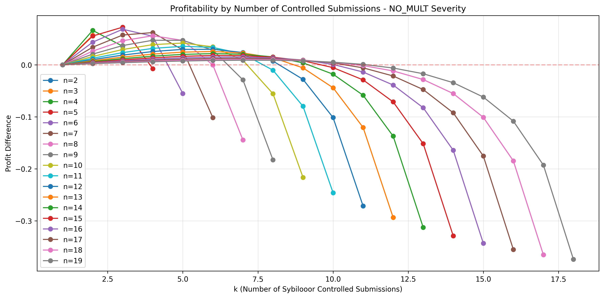

# The Sybilooor's Guide to Audit Competition Math

## Introduction

> If you already know what audit competitions are and how they work, I'd recommend you skip to the "So... what's this about?" section 😁.

### Context of Audit Competitions

Audit competitions have become a popular method for identifying severe vulnerabilities in blockchain-related programs, be it in client implementations, smart contracts or infrastructure which interacts with such systems.
Invented by [Code4rena](https://code4rena.com/) and popularized by themselves and similar platforms like [Sherlock](https://www.sherlock.xyz/) and [Cantina](https://cantina.xyz/), the audit competition model is fairly simple: anybody may show up, submit valid findings and get paid. No questions asked (sometimes).

By crowdsourcing the auditing process, organizations and start-ups can leverage the collective expertise of the community to enhance the security and resilience of their software. At the same time, security researchers are presented with a way to kickstart a career in the blockchain security field, a stage to flex their mighty skills on and highly attractive rewards. And of course, the contest platform takes a commission. Everybody wins!

 

During its early days, Code4rena would allow any anonymous user to register and participate in a given audit contest, which implies the ability for a single party to take part in a competition with multiple accounts with ease. In order to counteract pesky sybilooors, the C4 team found a solution in an exponential decay function, which would reduce the points granted by a given issue in function of how many participants had submitted a duplicate version of the issue. This in turn, **should** disincentivize users from submitting the same issue multiple times.

And thus, the audit competition scoring formula was born: $f(n) = 0.9^{n-1} / n$ , where $n$ stands for the number of times an issue is submitted.

Although not fundamental to what follows in this article, because different bugs imply different impacts of different severities, the C4 team had also made the decision of creating standard severities for issues: `High`, `Medium` and `QA`. While only `High` and `Medium` issues are used to score points, the points provided by them differ in a multiplicative constant:

$$
h(n) = 10 \cdot f(n)
$$

$$
m(n) = 3 \cdot f(n)
$$

These constants are only used to expand the exponential curve's tail upwards in the amount of points granted by such issues, but if we looked at the relative decrement in points provided by both $h(n)$ and $m(n)$, **percentage-wise** it would be the same.

Now that we have a mechanism to assign points scored by every issue, making a leaderboard is easy: we collect every issue from every participant and de-duplicate them to find how many duplicates were sent for every issue. A given participant's score is the sum of points granted by every issue he's sent. The more points someone scores, the better.
Finally to distribute the 💰 prize, you add up all of the points accumulated by all researchers and distribute the pot in the same proportion as the point assignment.

### So... what's this about?

While participating in a contest recently, a random thought crossed my head: 

> Are audit competitions **really** that sybil resistant? What if I submitted this bug twice? 🤔

While at that time I quickly disregarded the thought and kept working on my writeup, a curious example came to mind a couple of days later:

> If 2 researchers submit the same high issue, they both get $10 \cdot 0.9^1 / 2 = 4.5$ points.. and if 3 researchers do the same, they get $10 \cdot 0.9^2 / 3 = 2.7$ points. Hm.
>
> ...
>
> 🤯
>
> But if 2 of those researchers are actually a single person, he'd receive $2 \cdot 2.7 = 5.4$ points, which **is greater** than the amount of points he'd get if he sent the issue once..

As this realization hit me, I knew I had to dig deeper.

## Sybil Attack Vector

The attack vector is very straight forward: you're a new participant in the hottest audit competition out there and you have a nice chest of medium and high severity issues, and you've never believed that the pricing formula **actually** disincentivizes you to submit one those issues more than once in **every scenario**. 

In order to better understand what to do, you decide to crunch some simple numbers.

In the following sections, we'll be diving into how a sybilooor submitting $k$ out of $n$ duplicates of a particular issue affects the issue's scoring. Because the pricing mechanism for medium or high issues differs only by a constant factor, we won't be taking those into account. This provides a neat overview of the **relative** impact on the issue's scoring rather than the absolute impact in a succinct analysis.

### Profitability Analysis for different (n,k) pairs

With our k-out-of-n formulation, the effects of the sybilooors actions can be found as the difference between the points assigned by $f(n - k + 1)$ and $f(n)$:

- $f(n - k + 1)$ are the points assigned to the issue if the sybilooor were to behave correctly and submit the issue only once.
- $f(n)$ is as simple as it gets, it's the amount of points granted to the issue when it has $n$ duplicates: of such $n$, $k$ belong to the sybilooor while $n - k$ belong to other participants.   

Furthermore, because the sybilooor actually owns $k$ duplicates, we'll calculate the amount of points he receives as $k \cdot f(n)$.

Generating the dataset for $\Delta points = k \cdot f(n) - f(n - k + 1)$ for $n, k \in [2, 20)$ such that $k \leq n$ and visualizing it as a heatmap, this is what we get:

 

Observing the heatmap, we find that:

1. As expected, the main diagonal made up of pairs for which $n = k$, is entirely negative. This implies that it **never** makes sense for a sybilooor to sybil an issue only he has found. This really doesn't surprise us..
2. Looking at the heatmap's columns reveals an interesting insight: in scenarios for which $k \in [2, 6]$, if _at least_ one other participant has found the same issue, the sybilooor always banks a profit. In the best case, he receives $+0.124$ points than he would've received normally (before applying the issue's severity multiplier!).

What's more interesting is that the maximum bonuses a sybilooor may receive are generated from scenarios in which he must risk losing less points: $(n=5, k=3)$ and $(n=6, k=4)$ both generate the maximum bonus for the attacker, while $(n=3, k=3)$ poses a risk $-0.19$ points and $(n=4, k=4)$ poses a $-0.27$ potential loss before applying the severity multiplier.

### Impact on Other Participants' Rewards

When the sybilooor submits multiple duplicates of the same issue, a change in the amount of points he receives isn't the only impact brought by his actions: it also affects the points assigned to honest participants. Because the attacker is inflating an issue's $n$ value in the scoring formula:

1. The numerator $0.9^{n-1}$ decreases _exponentially_
2. The denominator $n$ decreases _linearly_

Because an exponential curve decreases faster than a straight line, the ratio between the two ultimately decreases as well. As a result, submissions sent by honest participants are awarded less points overall.

But how much damage are they dealt?

In order to understand this, we've formulated the issue as a simple subtraction between the scores assigned to an issue in the scenarios in which the sybilooor submits his issue only once and the scenario in which he submits $k$ total clones of the same issue. 

To quantify this impact, we can consider a scenario where there are 3 legitimate user submissions and 2 sybilooor submissions: $(n=5, k=2)$:

- Normal points per submission (3 legitimate submissions + 1 from sybilooor) : $0.9^3 / 4 = 0.182$ 
- Points with sybil attack (3 legitimate submissions + 2 from sybilooor) : $0.9^4 / 5 = 0.131$ 

This represents an absolute reduction of $0.182 - 0.131 = 0.051$ points assigned to the issue. In relative terms, it represents a $(0.131 - 0.182) / 0.182 = -28 \\%$ variation.  

Executing the same calculation for $n \in [3, 20)$ and $k \in [2, 19)$, we get the following values: (notice that examining the $k = n$ case would make little sense..)

 

## Practical Considerations

### Implementation Requirements

While you may already be thinking of the amount of points you'll take from the other poor researchers, when thinking of implementing this "profitable auditing strategy" there are several obstacles you'll have to get around of:

#### Amount of duplicates estimation

Your biggest problem by far.

The presented analysis relies on the core assumption that an attacker _somehow 🪄 magically 🪄 knows_ he won't end up in the $n = k$ danger zone. If this were to occur, it'd be a disaster: the attacker would lose points needlessly, donate rewards to all other participants and embarass himself..

So the first thing needed is a reliable way of estimating how many duplicates an issue will have at the end of the competition. But how?

While it may be easier for issues that have been part of the contest [meta](https://www.arc.unsw.edu.au/blitz/read/explainer-what-is-a-metaquestion) for a while (i.e. are very popular) like a missing `safeApprove` when interacting with `USDT`, this will definitely prove challenging once you get your hands on a more unique finding.

#### Multiple identity management

Every audit competition platform requires you to create an account, so you'll need as many separate accounts for as many duplicate submissions you intend on sending. Not just that, but you might need a few more accounts, just to not make it super obvious that this 6 user cabal always finds the same issues. 

Creating an account on a contest platform is usually done by providing one or many of the following:

1. An email account
2. A Github account
3. A discord account
4. A personal identification document (💀)
5. Personal tax information (💀)

While points 1-3 are really easy to generate multiples of, 4 and 5 will present you with quite a challenge if you wish to stay on the legal side of business.

#### Technical infrastructure 

Apart from posing yourself as multiple personas within conversations, discussions and overall interactions with other humans, you'll have to hide your online traces as well. 
For this, you will absolutely necessarily have to:

1. Use different browsers and/or browser containers to prevent cookie/session leakage between the different personas
2. Employ different IP addresses for each identity

And this may not even be enough.. (oh hey `Viewport-Width`, `Screen-Resolution` and `User-Agent` HTTP request headers, didn't see ya there!)

#### Detection Avoidance Challenges

Let's imagine you got through all of that.. There's still some other factors you must also consider stuff like:

- Submission timing patterns: you can't just send the same issue from all accounts at 5 seconds delay from one another..

- Your writing: how are you going to convince the competition judges you're actually 6 different researchers if you submit the exact same issue 6 times?! But they won't just notice the words you insert within the reports.. if you just rephrase some sentences they'll catch onto the similar style of writing between all of them.. Think you'll just use an LLM to do it for you? Cute. [gptzero.me](https://gptzero.me/) says hi. 

## Conclusion

While the scoring formula tries to play tough against duplicates, our analysis shows that with the right combination of duplicates and competitors, you can theoretically juice the system for an extra profit. But before you unleash your 50 anon accounts, remember that:

1. Predicting how many duplicates your issue will have is really **really** hard.
2. All of the issues and messages you send with any of your accounts will be stored by the platform, to which they will always be able to go back to and use to put the puzzle pieces together.
3. Are you really, morally fine with exploiting the current systems? An extra buck might sound nice at first, but when you take into consideration the zero-sum nature of competitions, you must think of whether you're the type of person that would cause harm to other honest participants for their own sake. 

At the end of the day, audit competitions remain robust, not because the math is perfect, but because the technical and operational hurdles make large-scale attacks really hard to pull off, while many researchers value their rep more than short-term gains (I hope).

🍉 out.

---

## Appendix

### 1. Live Judging: The Information Asymmetry Game-Changer

Throughout our analysis, we've operated under the assumption that our sybilooor is flying blind, trying to guess how many duplicates their issues will accumulate. But what if I told you that this assumption doesn't always hold true? 

Enter **live judging**.

Live judging is the practice of having contest judges classify and process submissions while the competition is still running. While this approach has obvious benefits for contest organization, participant feedback and overall reduces the time required to run a competition, it inadvertently creates an important information leak that a clever sybilooor could exploit.

#### The Intelligence Goldmine

When judges process submissions in real-time, they often provide feedback that reveals crucial information:

- **Duplicate Classifications**: "Your submission is a duplicate of issue X"
- **Severity Assessments**: Issues get tagged with (tentative) severity levels

For our sybilooor, this is like getting cheat codes to the estimation game we described earlier.

#### From Blind Guessing to Strategic Intelligence

Remember our biggest practical consideration from earlier? The estimation problem. Well, live judging just made it significantly easier.

Here's how a smart sybilooor could leverage this information: our sybilooor submits each of their unique findings exactly once, using their "main" account. They then monitor live judging results. During the competition's duration, the sybilooor is able to collect information leaked by live judging. For issues confirmed as duplicates, our sybilooor can now make informed decisions about additional submissions to be submitted before the competition ends.

#### The Numbers Game, Revisited

Let's now revisit our profitability analysis with this new intelligence advantage. Consider a scenario where our sybilooor learns that their high-severity issue is currently sitting at 3 total duplicates (including their original submission).

Using the ($10 \cdot 0.9^{n-1} / n$) formula, they can calculate:
- **Current state** $(n=3, k=1)$: They receive $10 \cdot 0.9^2 / 3 = 2.7$ points
- **If they submit 2 more** $(n=5, k=3)$: They receive $3 \cdot 10 \cdot 0.9^4 / 5 = 3.936$ points

Which grants a $+1.236$ point bonus just from having better information! 🤯

The beauty (or horror, depending on your perspective 🤓) is that following strategy reduces the attacker's risk significantly. The sybilooor no longer needs to worry about ending up in the dangerous red zone where they're effectively losing points.

#### Why This Changes Everything

Live judging transforms our sybilooor from a gambler into a strategic player with partial information. The estimation problem - our biggest practical consideration - becomes significantly more manageable.

Instead of the blind "spray and pray" approach we described earlier, live judging enables surgical strikes on specific issues where the attacker has confirmed intelligence about duplicate counts.

#### The Platform's Dilemma

Contest platforms face a tough trade-off:
- **Live judging** improves participant experience and contest organization
- But it also provides the very information that makes sybil attacks more viable

Some platforms have started implementing delayed judging or partial information disclosure, but these approaches come with their own operational challenges.

The existence of live judging practices makes the sybil attack vector we've analyzed significantly more practical and profitable. What started as a theoretical mathematical vulnerability becomes a real-world exploit when combined with the intelligence advantages that live judging provides.

Our sybilooor just got a major upgrade. 📈 

### 2. Well, actually...

Throughout the article I hid something from you, dear reader...

Not all audit competition platforms use the same formula! While Code4rena first introduced the $0.9^{n-1} / n$ formula, it no longer uses it! Currently, they're using a $0.85$ exponential decay value instead of $0.9$.  

Want to take a look at how this affects the data we've looked through? Here you go:

 
 

That's quite a change in the profitability heatmap: not only have they shifted the sweet spot upwards and to the left, but they've also reduced the overall payoff in every scenario and the maximum bonus an attacker receives has been nearly halved. Furthermore, now only $k \in [2, 3]$ provides the only "risk-less" columns.  

### Code

The small python file used to conduct the analysis and generate the data visualizations can be found at [repo](https://github.com/electisec/contest_sybil_research).

### Additional Visualizations

#### Profitability line plot

- Sherlock & Cantina ($0.9^{n-1} / n$)
 

- Code4rena ($0.85^{n-1} / n$)

