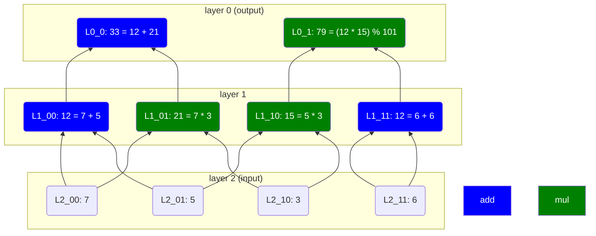

# Understanding the Sum-Check Protocol: A Step-by-Step Guide

The Sum-Check Protocol is a fundamental tool in cryptographic proofs, particularly in zero-knowledge proofs (ZKPs) and verifiable computation. It allows a verifier to efficiently check that a prover has correctly summed up evaluations of a polynomial over a boolean hypercube without computing every evaluation explicitly.

If that sounds confusing, don't worry, that’s exactly why this article exists.

We’ll break down the key concepts needed to understand the Sum-Check Protocol and then walk through the protocol itself in an easy-to-follow manner.

To assist you, I wrote a few scripts with Sage: https://github.com/teddav/sumcheck-article

## **Building Blocks for Sum-Check**

Before diving into the Sum-Check Protocol, we need to understand some fundamental mathematical concepts.

### **1. Multivariate and multilinear polynomials**

A **multivariate polynomial** is a polynomial with more than one variable. For example:

$$
f(x,y)=3x^3y^4+2xy^2+5y+7
$$

<aside>
💡

A **multivariate polynomial** is typically written as:

$$
f(\vec{x})
$$

where $\vec{x}$ is a vector of variables, ex: $\vec{x} = (x_1, x_2, \dots, x_n)$.
Its length corresponds to the number of input variables in the function.

</aside>

Key things to note:

- **Degree of each variable**: The highest exponent of each variable. Here, `x` has degree 3 and `y` has degree 4
- **Degree of the polynomial**: The term with the maximum combined degree, which is 7 (3+4) for the previous example

Other examples:

- $x *y^2$ has degree 3 (since `x` has 1 and `y` has 2)
- $x*y*z$ also has degree 3
- $x*z$ has degree 2

A **multilinear polynomial** is a special type of multivariate polynomial where each variable appears with at most a degree of 1 (i.e., no exponents greater than 1).

For example:

$$
f(x, y, z) = x*y*z + x*z + z + 5
$$

This polynomial is multilinear and has degree **3**. Notice that the degree of the polynomial is at max the number of variables.

Multilinear polynomials are especially important in Sum-Check because the protocol works efficiently with them.

Here’s a small Sage script for experimenting

```python
F = GF(17)
R.<x, y, z> = PolynomialRing(F, order="lex")

P = 6*x^3*z^3*y - 6*z^2 - x - 2*y + 6
assert(P.degree() == 7)

P = R.random_element(degree=5)
print("deg 5 poly", P)
print("P * z", P * z)

print("----------")

P = R.random_element(degree=2)
print(P)
print(P(1,2,3))

print("----------")

# how are terms sorted?
P = 6*x*y - 6*z^2 - x^2 + y^2 - 2*y + 6*x + z + z^3 + x*z + y*z
print(P.dict())
print(P)

print("----------")

# we can get it sorted in a different order
# here it's degrevlex, which is "degree reverse lexicographic order"
# https://doc.sagemath.org/html/en/reference/polynomial_rings/sage/rings/polynomial/term_order.html
R.<x, y, z> = PolynomialRing(F, order="degrevlex")
# P = 6*x*y - 6*z^2 - x^2 + y^2 - 2*y + 6*x + z + z^3 + x*z + y*z
# let's use the same polynomial
P = R(P)
print(P)

print("Multilinear")
P = 5*x*y + 7*y + x*y*z + 7
print(P)
```

### **2. Boolean hypercube**

If you Google “hypercube” you’ll probably see geometric shapes representing cubes in higher dimensions.

We don’t really care about the geometrical representation (at least I don’t, it confuses me more than anything…). But just so you know, here are examples of **n-dimensional hypercubes:**

- **0D hypercube:** A single point
- **1D hypercube:** A line
- **2D hypercube:** A square
- **3D hypercube:** A cube
- **4D hypercube:** A tesseract
- …

From now, let’s focus on what really matters: **the structure of hypercubes as sets of points.**

An **n-dimensional hypercube** consists of all possible tuples of length `n` where each element comes from a fixed set.

For example, if we pick the elements `{a, b}`, the 3D hypercube is:

```
(a, a, a), (a, a, b), (a, b, a), (a, b, b), (b, a, a), (b, a, b), (b, b, a), (b, b, b)
```

The most common hypercube in cryptography is the **boolean hypercube**, where the elements are always `{0,1}`.

For example, the **3D boolean hypercube** (with `{0,1}` as elements) is:

```
(0, 0, 0), (0, 0, 1), (0, 1, 0), (0, 1, 1), (1, 0, 0), (1, 0, 1), (1, 1, 0), (1, 1, 1)
```

The 2D boolean hypercube:

```
(0,0), (0,1), (1,0), (1,1)
```

**How I think about it:** binary representation.

If you want an `n`-dimensional boolean hypercube, just list all numbers in binary representation from `0` to `2^n - 1`.

Example for `n = 3`:

```python
# Decimal
[0, 1, 2, 3, 4, 5, 6, 7]

# or Binary strings
['000', '001', '010', '011', '100', '101', '110', '111']

# or Tuples
[[0, 0, 0], [0, 0, 1], [0, 1, 0], [0, 1, 1], [1, 0, 0], [1, 0, 1], [1, 1, 0], [1, 1, 1]]
```

### **3. Connect multivariate polynomials and the boolean hypercube**

The link between multilinear polynomials and hypercubes is simple:

- The **number of variables** in the polynomial determines the **dimension** of the hypercube needed for evaluation.
- **Evaluating the polynomial over the hypercube** means substituting every tuple into the polynomial and summing the results.

Let’s take an example:

$$
f(x, y, z) = x*y + z + 2
$$

Since `f` has 3 variables, we use the **3D boolean hypercube**:

```python
[[0, 0, 0], [0, 0, 1], [0, 1, 0], [0, 1, 1], [1, 0, 0], [1, 0, 1], [1, 1, 0], [1, 1, 1]]
```

Now, we **evaluate `f` at every point**:

```python
f(0, 0, 0) + f(0, 0, 1)
+ f(0, 1, 0) + f(0, 1, 1)
+ f(1, 0, 0) + f(1, 0, 1)
+ f(1, 1, 0) + f(1, 1, 1)
```

This sum is what the Sum-Check Protocol verifies efficiently!

We can write it cleanly as:

$$
\displaystyle\sum_{x,y,z \in \{0,1\}}{f(x,y,z)}
$$

To generate the **boolean hypercube** in Python:

```python
cube = [(a,b,c) for a in [0,1] for b in [0,1] for c in [0,1]]
```

A more general version using `itertools`:

```python
import itertools

dimension = 3
bool_hypercube = list(itertools.product([0, 1], repeat=dimension))
```

This gives the same result, but works for **any** number of dimensions!

My gift: a Sage script to evaluate a polynomial over a boolean hypercube:

```python
import itertools

dimension = 3
cube = list(itertools.product([0, 1], repeat=dimension))

F = GF(17)
R.<a, b, c> = F[]

# this one is multilinear, but it doesn't change anything
P = 6*a*b*c + 5*a*b + 4*a*c + 3*a + 2*b*c + b + 7

# we can check the degrees of each variable
assert(P.degrees() == (1,1,1))
print("P:", P)

# we can evaluate the polynomial over the hypercube
S = sum([P(i) for i in cube])
print("Sum of the polynomial over the hypercube:", S)
```

### **4. What is a "multilinear extension" (MLE)?**

You’ll often see the term **“multilinear extension”** in papers and documentation. At first, this confused me, but it’s just a fancy way of saying **a multilinear polynomial that accepts more than boolean inputs.**

To get the MLE of a function, we interpolate a multilinear polynomial from $\{0,1\}^n$ inputs.

This interpolated polynomial is **initially only defined over {0,1} inputs**. However, we can evaluate this polynomial at **non-boolean values** (like `2`, `3.5`, or `-1`), effectively "extending" it beyond the hypercube.

This "extension" will be crucial in the sum-check Protocol, allowing the prover to reduce the sum efficiently.

If we start with a function `$f(x_1,...x_n)$` defined over the boolean hypercube, we can find many multivariate polynomials over $\mathbb{F}$ that agree with `f` on boolean inputs.

However, there’s exactly **one** polynomial that **both agrees with `f` on the hypercube and is multilinear** (has degree at most 1 in each variable): **this unique multilinear polynomial is what we call the multilinear extension of $f$.**

The MLE of a function is often written with `~`. So the MLE of $f(x)$ will be written as $\tilde{f}(x)$.

### **5. Multilinear Lagrange interpolation over the boolean hypercube**

The last tool we need before diving into the Sum-Check Protocol is **Lagrange interpolation** for multilinear polynomials. This is how we’re going to construct our MLEs.

Lagrange interpolation allows us to reconstruct a polynomial from its values at specific points. To determine a polynomial of degree `d`, we need at least `d + 1` points. If you’re unfamiliar with the concept, I highly recommend watching [this video](https://www.youtube.com/watch?v=bzp_q7NDdd4&ab_channel=Dr.WillWood).

For a univariate polynomial, the Lagrange interpolation formula is:

$$
P(x) = \sum_{i} y_i \cdot \ell_i(x)
$$

Where $\ell_i(x)$ are the **Lagrange basis polynomials** that ensure the polynomial takes on the given values at the specified points. And $y_i$ is just the `y` value of the point.

For multivariate polynomials, we extend this idea to the boolean hypercube. Given values at all points of $\{0,1\}^n$, we can construct the unique **multilinear polynomial** that interpolates these values. This interpolation step is crucial in Sum-Check because it allows us to express each intermediate step as a new polynomial with fewer variables (you’ll see exactly how when we get to the protocol 😁).

In standard Lagrange interpolation, the basis polynomial for point $p_i$ is defined to be 1 at $p_i$ and 0 at all other points, then scaled by $y_i$.

For multilinear interpolation, we work with **boolean inputs** (`0` and `1`), so we use `x` and `1 - x` as "selectors" to construct basis polynomials.

- `x` evaluates to `1` when `x = 1` and `0` when `x = 0`.
- `(1 - x)` evaluates to `1` when `x = 0` and `0` when `x = 1`.

This allows us to construct basis polynomials for each point in $\{0,1\}^n$. For example, the basis polynomial for the point `(0,1,0)` is:

$$
(1-x)*y*(1-z)
$$

This expression evaluates to **1 only at (0,1,0)** and **0 at all other points**. Try it yourself!

Here’s a SageMath implementation of multilinear interpolation:

```python
F = GF(101)
R.<a,b> = F[]

def multilinear_lagrange_interpolation(points, values):
    def basis_polynomial(point):
        result = R(1)
        result *= a if point[0] == 1 else (1 - a)
        result *= b if point[1] == 1 else (1 - b)
        return result

    interpolation_polynomial = R(0)

    for i in range(len(points)):
        interpolation_polynomial += F(values[i]) * basis_polynomial(points[i])

    return interpolation_polynomial

points = [(0, 0), (0, 1), (1, 0), (1, 1)]
values = [3, 5, 7, 11]

P = multilinear_lagrange_interpolation(points, values)
print("P: ", P)

assert(P(points[0]) == values[0])
assert(P(points[1]) == values[1])
assert(P(points[2]) == values[2])
assert(P(points[3]) == values[3])
```

Pretty cool, right? 😎 This approach can easily be extended to higher dimensions.

### 6. Equality function

When looking into Sum-check, you’ll often run into something called the **equality function**.

This function takes two inputs `x` and `y`, each in $\{0,1\}^n$, and returns:

- eq(x,y) = 1, if x = y
- eq(x,y) = 0, if x ≠ y

Its **multilinear extension** over a field $\mathbb{F}$ is given by:

$$
eq(x,y)=\displaystyle\prod_{i=0}^{n-1}x_iy_i+(1-x_i)(1-y_i)
$$

This might look a bit messy, but it’s just encoding the idea that each bit of `x` must match the corresponding bit of `y`. If any bit differs, one of the terms becomes 0, and the whole product evaluates to 0.

Let’s see what this looks like in the 2-bit case, where $x=(x_1,x_2)$:

- $eq(x_1,x_2,(0,0))=(1-x_1)(1-x_2)$
- $eq(x_1,x_2,(0,1))=(1-x_1)x_2$
- $eq(x_1,x_2,(1,0))=x_1(1-x_2)$
- $eq(x_1,x_2,(1,1))=x_1x_2$

You can check that each of these polynomials evaluates to 1 only at the matching input, and 0 everywhere else.

If you look closely at this expression, you’ll notice that it’s **exactly what the Lagrange basis looked like earlier**, but now written as a single polynomial.

Let’s say you have a multivariate function `g(x)` defined over the boolean hypercube $\{0,1\}^n$, and you want to construct its multilinear extension $\tilde{g}(y)$ over $\mathbb{F}^n$.

You can use the equality function to do this:

$$
\tilde{g}(y)=\displaystyle\sum_{x \in \{0,1\}^n}{g(x)*eq(x,y)}
$$

This works because the equality function is 1 when x=y, and 0 everywhere else (only when `x` and `y` are values of the boolean hypercube). So in this sum, only the term where x=y contributes anything, all the others vanish. What you’re left with is the value of `g` at `y`.

See on Github for an example: https://github.com/teddav/sumcheck-article/blob/main/eq.sage

We now have all the knowledge 🧠 to understand the Sum-check. Let’s get into it! 🥳

## Sum-check overview

Before diving into the details, let's get a high-level understanding of what the Sum-check Protocol does.

From the name alone, and based on what we’ve covered so far, you might guess that it involves summing a multivariate polynomial and verifying that sum. And you'd be right!

The protocol starts with a multivariate polynomial:

$$
f(x_1,x_2,...,x_n)
$$

We then evaluate this polynomial over all points in the boolean hypercube:

$$
H = \displaystyle\sum_{v_1 \in \{0,1\}}\displaystyle\sum_{v_2 \in \{0,1\}}...\displaystyle\sum_{v_n \in \{0,1\}}f(v_1,v_2,...,v_n)
$$

The goal of Sum-Check is to allow a prover to convince a verifier that this sum is correct, without requiring the verifier to compute every evaluation directly.

## **Why Does This Matter?**

The Sum-Check Protocol has many applications, which we’ll explore later. However, one of its most important uses is in zero-knowledge (ZK) proof systems.

If you’re familiar with how modern proof systems work, you might know that a large part of their computational cost comes from polynomial interpolation, often using the Fast Fourier Transform (FFT).

With Sum-check, verifying a polynomial over the boolean hypercube becomes significantly more efficient. Instead of interpolating a high-degree univariate polynomial, we can work with a multilinear polynomial, which is much easier to handle.

In fact, the Sum-Check Protocol allows the verifier to be convinced in just **n steps** (linear in the number of variables).

For example, in **PLONK**, Sum-Check can replace the divisibility test (or quotient test) and the KZG polynomial commitment, leading to performance improvements. That’s what HyperPlonk does.

TO IMPROVE

### **How Many Variables Does My Polynomial Need?**

Suppose we need to interpolate a polynomial over $2^n$ values.

If we used a **univariate** polynomial, it would need degree $2^n-1$

Instead, with a **multivariate** polynomial, we only need `n` variables: $log_2(2^n)$.

This follows from binary representation: To encode $2^n$ distinct values, we need an `n`-bit binary number.

Example:

Say we want to evaluate a univariate polynomial at 32 points. Instead of using a degree-31 polynomial, we can work with a multilinear polynomial with **5 variables** (since $log_2(32)=5$)

Each evaluation corresponds to a binary string from **0b00000 to 0b11111**, covering all 32 possible inputs.

## The Sum-Check

Now that we have the foundation and a rough understanding of what Sumcheck is for, let’s break down how it actually works.

I'll first describe the steps, then we’ll go through an example using Sage.

As expected, we start with a multivariate polynomial `P(x1,x2)` (we start with 2 variables, we’ll go with more later) evaluated over the boolean hypercube, producing a result `H`:

$$
H=\displaystyle\sum_{x_1,x_2 \in \{0,1\}}{P(x_1,x_2)}
$$

Expanding this sum, we get:

$$
H=P(0,0)+P(0,1)+P(1,0)+P(1,1)
$$

The goal of the protocol is to gradually reduce the number of variables in P, one by one, while ensuring correctness at each step.

### Step 1: Summation Polynomial

At each round, we eliminate one variable by constructing a new polynomial that depends on one less variable.

To do this, we define a **univariate polynomial** that captures the contribution of one variable at a time. Specifically, we create a new polynomial `g1(x)` in which `x1` remains a variable, but `x2` is summed out:

$$
g_1(x_1)=P(x_1,0)+P(x_1,1)
$$

This means we are still evaluating P at all boolean values of x2, but we express the sum as a function of x1.

The idea is that we are reducing the number of variables while preserving the overall sum.

### Step 2: Verifier checks the sum

The Verifier already knows `H`, so they can check whether $g_1(x)$ was computed correctly by verifying:

$$
H \stackrel{?}{=} g_1(0)+g_1(1)
$$

If this equation holds, we can go on to the next step.

### Step 3: Choosing a random point

Once the verifier is convinced that $g_1(x)$ is correct, they choose a random point `r1` and ask the prover to evaluate P at $x_1=r_1$, reducing the number of variables:

$$
P(r_1,x_2)
$$

The essentially fixes $x_1$ and leaves only $x_2$ as a variable.

But why do we need to sample a random point?

This is the heart of the protocol and it relies on the **Schwartz–Zippel lemma**.

Roughly speaking:

> If you have two different polynomials `P(x)` and `Q(x)`, the chance that they accidentally agree at a random point `a` is very small.
>
> More precisely: if `P(x)` has degree `p` and `Q(x)` has degree `q`, they can only be equal at at most $\max(p,q)$ points.

So picking a random `r` ensures that if the prover tried to cheat (by pretending a fake `P` or faking the intermediate polynomials `g`), the verifier would catch it with high probability.

You can find a deeper explanation on Rareskills’ blog: https://www.rareskills.io/post/schwartz-zippel-lemma

**In short: randomness forces the prover to stay honest, otherwise they almost certainly get caught.**

### **Next Round: Continuing the Process**

In the second round, we apply the same process again. We define a new polynomial:

$$
g_2(x)=P(r_1,x)
$$

The verifier then checks:

$$
g_2(0)+g_2(1) \stackrel{?}{=} g_1(r_1)
$$

At this point, only one variable remains, so we finish by evaluating:

$$
S=P(r_1,r_2)
$$

This final value is sent to the verifier, who uses it for the final verification step:

$$
P(r_1,r_2) \stackrel{?}{=} g_2(r_2)
$$

This process generalizes to more variables. Each round eliminates one variable while ensuring correctness, allowing the protocol to efficiently verify large sums without explicitly computing them.

## Example with Sage

### 2 variables

Let’s go through a concrete example of the Sumcheck protocol with **2 variables**. We’ll define a multilinear polynomial, compute the sum over the boolean hypercube, and step through the prover-verifier interactions.

```python
F = GF(101)

# Define a polynomial ring with two variables
R.<x1,x2> = F[]

# Define a univariate polynomial ring (for later reductions)
Rx.<x> = F[]

# Define a random multilinear polynomial
P = 1 + x2 + x1 + x1*x2

# Compute the sum of P over the boolean hypercube
H = P(0, 0) + P(0, 1) + P(1, 0) + P(1, 1)
print(f"H = {H}")

# Prover constructs g1(x) = P(x,0) + P(x,1)
g1 = P(x1,0) + P(x1,1)

# Convert g1 to a univariate polynomial in x (just for clarity)
g1 = Rx(g1(x, 0))
print(f"g1 = {g1}")

# Verifier checks if g1 correctly sums to H
print(f"g1(0) + g1(1) = {g1(0) + g1(1)} (should equal {H})")
assert g1(0) + g1(1) == H

# Verifier sends a random challenge r1
r1 = 31

# Prover constructs g2(x) = P(r1, x)
g2 = P(r1, x2)

# Convert g2 to a univariate polynomial in x (for clarity)
g2 = Rx(g2(0, x))
print(f"g2 = {g2}")

# Verifier checks if g2 correctly sums to g1(r1)
print(f"g2(0) + g2(1) = {g2(0) + g2(1)} ( should equal {g1(r1)})")
assert g2(0) + g2(1) == g1(r1)

r2 = 43
assert g2(r2) == P(r1, r2)
```

The comments should be clear enough 😉

`g1 = Rx(g1(x, 0))` is purely for clarity. It casts `g1` from a multivariate polynomial ring (`R`) to a univariate ring (`Rx`). This makes it explicit that `g1` is now a polynomial in a single variable.

You’ll find another example with 3 variables on my Github: https://github.com/teddav/sumcheck-article/blob/main/sumcheck.sage

When exposing the protocol previously, we forgot one important step: check the degree of `g`. If the verifier forgets, the prover can easily cheat. Let’s see how.

## Trick the Verifier?

At first glance, it might seem easy to trick the verifier during the first round of the protocol. Let’s walk through an example to see how this can happen:

```python
F = GF(101)
R.<x1,x2> = F[]
Rx.<x> = F[]

P = 15*x1*x2 + 50*x1 + 11
print(f"P = {P}")

H = P(0, 0) + P(0, 1) + P(1, 0) + P(1, 1)
print(f"H = {H}")

g1 = P(x1,0) + P(x1,1)
g1 = Rx(g1(x, 0))
print(f"g1 = {g1}")
assert g1(0) + g1(1) == H

# Now, let's try to trick the verifier
# Fake g1 using Lagrange interpolation
fake_g1 = Rx.lagrange_polynomial([(0, 1), (1, H-1)])
print(f"fake_g1 = {fake_g1}")
# The fake g1 passes the check!
assert fake_g1(0) + fake_g1(1) == H
```

In the code above, we create a fake `g1` using Lagrange interpolation, which makes it pass the verification step 🤯.

Remember that we want to prove that $g(0)+g(1)=H$, so I used values `1` and `H-1` to make this addition pass, but you can use any pair of values that sum to H.

However, don’t panic just yet, the deception will be caught in the next round due to the random challenge introduced by the verifier.

```python
# Verifier sends a random challenge r1
r1 = 71

g2 = P(r1, x2)
g2 = Rx(g2(0, x))
print(f"g2 = {g2}")
assert g2(0) + g2(1) == g1(r1)

# Let's check if the fake g1 still works
print(f"g2(0) + g2(1) == fake_g1(r1)? {g2(0) + g2(1) == fake_g1(r1)}")
# The fake g1 will fail at this step
assert g2(0) + g2(1) != fake_g1(r1)
```

As you can see, the fake `g1` fails the verification in the second round because the value of `g2(0) + g2(1)` does not match `fake_g1(r1)`. This is a key reason why the Sum-Check protocol is secure: **once randomness is introduced, it becomes much harder to manipulate the calculations.**

But there’s still something missing… Can you see it?

### g(x) degree bound

The real problem arises from the fact that, without proper restrictions on the degree of the polynomial, an attacker can interpolate a fake polynomial that will pass the test `g2(0) + g2(1) == fake_g1(r1)`.

We know that:

$$
g_2(x)=P(r_1,x)
$$

We are working in a small field $\mathbb{F}_{101}$, so it's possible to create a polynomial that fits the required conditions by evaluating $P(i, 0) + P(i, 1)$ for every value in the field.

Here's how we can demonstrate the issue with the code:

```python
points = [(0, 1), (1, H-1)]

# we interpolate a polynomial where the condition is verified for every point in the field
points += [(i, P(i, 0) + P(i, 1)) for i in range(2, 101)]
fake_g1 = Rx.lagrange_polynomial(points)
print(f"fake_g1 degree: {fake_g1.degree()}")

assert g2(0) + g2(1) == fake_g1(r1)
```

To prevent such exploits, the verifier must check the **degree** of the polynomial `g` at each step.

The polynomial $g_i$ must be at most of degree of the variable at index `i`. If the degree of `g` is higher than expected, the verifier knows that something is wrong.

We’ll often use multilinear polynomials with the Sumcheck protocol. In that case `g` must be at most of degree 1.

This degree-bound check is what ultimately prevents malicious attempts to cheat the system and ensures the integrity of the Sumcheck protocol.

## Make it ZK

The Sumcheck protocol is not zero-knowledge, but we can make it so with a simple process. Let’s say we want to prove that

$$
H=\displaystyle\sum_{x\in\{0,1\}^n}{P(x)}
$$

- pick a random polynomial `Q` of same degree as `P`
- he computes the sum $H'$ of Q over the boolean hypercube
- verifier sends a random value $\rho \in \mathbb{F}$
- prover and verifier run Sumcheck on the masked polynomial:

$$
H + \rho * H'=\displaystyle\sum_{x \in \{0,1\}^n}{P(x)+\rho*Q(x)}
$$

Since `Q` is random and hidden, the verifier learns nothing about `P(x)`, but correctness is still guaranteed, thanks to the random $\rho$.

See the step-by-step process here: https://github.com/teddav/sumcheck-article/blob/main/sumcheck_zk.sage

## Apply Sum-Check to AIR

We talked before about how Sum-Check is a good way to avoid polynomial interpolation.

Let’s see a step by step process of Sum-Check on a (simplified) AIR trace.

### Zerocheck

Let’s introduce the **Zerocheck protocol**, a protocol based on Sumcheck used to prove that a polynomial `P` is zero on the entire boolean hypercube.

Let’s recall how the multilinear extension (MLE) of a function $f: \{0,1\}^n \to \mathbb{F}$ is defined:

$$
\tilde{f}(z)=\displaystyle\sum_{x \in \{0,1\}^n}{f(x)*eq(x,z)}
$$

In this expression, the sum is over boolean inputs `x`, while `z` can be any point in the field, since the MLE is defined over $\mathbb{F}$.

Now, if $f(x)=0$ for all boolean `x`, then `$\tilde{f}(z)$` is the zero polynomial (meaning it evaluates to zero for **all $z \in \mathbb{F}^n$**). So in particular, it must hold that:

$$
\tilde{f}(r)=0
$$

for any randomly chosen point `r` (picked by the verifier): **this is what we want to prove.**

But how do we prove that with Sumcheck?

We start by turning the definition of $\tilde{f}(r)$ into a sum over the hypercube, a format that Sumcheck can handle. To do this, we “reverse” the MLE expression: fix `r`, and treat `eq(x, r)` as a known function to the verifier.

Then define:

$$
g(x)=f(x)*eq(x,r)
$$

At the start of the protocol, the prover commits to $f(x)$ (using any multivariate polynomial commitment scheme).

The verifier knows `r` and can recompute `eq(x, r)`, and also has a commitment to $f(x)$. We can therefore consider that the verifier has a commitment to $g(x)$, so **the prover can’t cheat anymore**. Any tampering with `g(x)` will be detected at the end.

Now observe:

$$
\displaystyle\sum_{x \in \{0,1\}^n}{g(x)}=\displaystyle\sum_{x \in \{0,1\}^n}{f(x)*eq(x,r)}=\tilde{f}(r)
$$

So the sum of `g(x)` over the cube equals `$\tilde{f}(r)$`, which we expect to be zero.

At this point, the verifier and prover can run the Sumcheck protocol on `g(x)`.

During the process, remember that we progressively fix variables using randomness, we’ll denote this fresh randomness as `r'`.

In the final step, the verifier asks for an evaluation of `f` at `r'` (remember that f was committed, so the prover can’t cheat), and independently computes `eq(r', r)` to validate that `g(x)` was formed correctly.

If everything checks out, the verifier is convinced that `f(x)` is zero on the entire boolean hypercube, without evaluating at all $2^n$ values.

### AIR

Now that we understand Zerocheck, applying it to AIR becomes almost trivial.

If you're not familiar with AIR, check out the [STARK by hand tutorial](https://dev.risczero.com/proof-system/stark-by-hand).

The steps are:

- **Interpolate** each column of the execution trace over the boolean hypercube → obtain multilinear polynomials.
- **Construct** the constraint polynomial `$P$`, designed so that $P(x) = 0$ for every point on the hypercube
- **Run Zerocheck** on P to prove that all constraints are satisfied.

In other words: Zerocheck lets us efficiently verify that our trace satisfies all the AIR constraints without checking every point individually.

Here’s a script describing the full process.

You’ll also find it here: https://github.com/teddav/sumcheck-article/blob/main/zerocheck-air.sage

```python
F = GF(101)
R.<x1,x2,y1,y2> = F[]

cube = [(0,0),(0,1),(1,0),(1,1)]

def eq(y):
    beta = F(1)
    beta *= x1 * y[0] + (1 - x1) * (1 - y[0])
    beta *= x2 * y[1] + (1 - x2) * (1 - y[1])
    return beta

def mle(values):
    return sum(values[i] * eq(c) for i,c in enumerate(cube))

a = [2,5,11,7]
b = [3,2,8,7]
c = [6,10,88,49]

# we interpolate a polynomial for the values of a, b, c
A = mle(a)
B = mle(b)
C = mle(c)

# we construct our constraint polynomial
# it is zero for all points in the cube
P = A * B - C
print("P =", P)

assert P(x1=0,x2=0) == 0
assert P(x1=0,x2=1) == 0
assert P(x1=1,x2=0) == 0
assert P(x1=1,x2=1) == 0

# we compute the MLE of P
# since P is zero for all points in the cube, the MLE is zero
P_mle = sum(P(x1=c[0],x2=c[1]) * eq([c[0],c[1]]) for c in cube)
print("P_mle =", P_mle)
assert P_mle == 0

# pick a random point in F
# we ultimately want to prove that P_mle(r) = 0
r = [29, 43] # random

# first we compute the "equality function" at r
eq_r = eq(r)
print("eq_r =", eq_r)

# then we compute the product of P and eq_r
S = P * eq_r
print("S =", S)

# S is zero for all points in the cube
assert S(x1=0,x2=0) == 0
assert S(x1=0,x2=1) == 0
assert S(x1=1,x2=0) == 0
assert S(x1=1,x2=1) == 0

# and obviously the sum of S over the cube is zero
H = sum(S(x1=c[0],x2=c[1]) for c in cube)
print("SUM:", H)
assert H == 0

print("===== SUMCHECK =====")
# randomness needed for the sumcheck
r_prime = [41, 79]

# remember that we need to bound the degree of the polynomials g1 and g2
(g1_deg_bound, g2_deg_bound, *_) = S.degrees()
print("g1_deg_bound =", g1_deg_bound)
print("g2_deg_bound =", g2_deg_bound)

# round 1
g1 = R(S(x2=0) + S(x2=1))
print("g1 =", g1)
assert g1(x1=0) + g1(x1=1) == H
assert g1.degree() <= g1_deg_bound

# round 2
g2 = R(S(x1=r_prime[0]))
print("g2 =", g2)
assert g2(x2=0) + g2(x2=1) == g1(x1=r_prime[0])
assert g2.degree() <= g2_deg_bound

print("Verifier recomputes S")
print("we receive P(x1=r_prime[0], x2=r_prime[1]) from polynomial commitment")
print("and the verifier can easily recompute eq_r himself")
S_prime = P(x1=r_prime[0], x2=r_prime[1]) * eq_r(x1=r_prime[0], x2=r_prime[1])
assert g2(x2=r_prime[1]) == S_prime
print("sumcheck passed")
```

We made it to the end! You should be able to understand why we use Sumcheck, and how it works.

Sumcheck is a beautifully simple yet powerful protocol: it transforms a complex global claim ("this sum over many points equals X") into a small, interactive protocol involving only polynomials of low degree.

By carefully using randomness and the structure of multilinear extensions, it allows the verifier to be convinced with high probability while doing only a tiny amount of work.

Mastering Sumcheck gives you a solid foundation to understand modern proof systems, and appreciate the cleverness hidden behind their efficiency.

## Bonus: Intro to GKR

Now let’s talk about GKR. I won’t go too deep into the details here. The goal is to keep this section relatively light, and I’ll link to some resources if you want to dive deeper.

The GKR protocol, introduced by Goldwasser, Kalai, and Rothblum in 2008, is an interactive proof system for verifying the correctness of computations represented as arithmetic circuits. It’s a natural extension of the Sumcheck protocol and works especially well for computations that can be expressed as layered circuits.

Suppose you have a computation that takes a large input and applies several layers of arithmetic operations to produce an output. Re-running the entire computation just to verify the output would be expensive. But what if the verifier could efficiently check the result without redoing all the work or blindly trusting the prover? Sounds familiar, right? That’s the Sumcheck spirit, and GKR builds on that.

### Layered circuit

GKR assumes an arithmetic circuit structured into `d` layers.

To keep things consistent, we’ll label the top layer (the output) as layer `0`, and increase the index as we go down to the input layer, which is layer `d`. Each gate in layer `i` performs an arithmetic operation (either addition or multiplication) on the outputs of two gates in layer `i + 1`.

I made a simple circuit as an example:



Layer 2 is our input layer [7, 5, 3, 6], and the circuit outputs [33, 79] (operations are in $\mathbb{F}_{101}$).

Since we’re working with multivariate polynomials, we use binary encodings for gate indices over the boolean hypercube (ex: `00`, `01`,…). That’s why I indicated `_00`, `_01`, …

The relationships between layer 2 and layer 1 gates can be written as:

$$
L_1(00) = L_2(00)+L_2(01) \\
L_1(01) = L_2(00)*L_2(10) \\
L_1(10) = L_2(01)*L_2(10) \\
L_1(11) = L_2(11)+L_2(11)
$$

But these aren’t in a form we can use directly with Sumcheck. To apply it, we need to express each layer as a polynomial relation involving a sum over the boolean cube.

Something like:

$$
L_1=\displaystyle\sum_{b \in {\{0,1\}}^2}L_2(b)
$$

### Selector polynomials

We’ll define selectors that activate only when a gate applies a specific operation. In our simple circuit, we have 2 types of gates: `add` and `mul`.

For instance, to compute the value at gate `a` in layer `i`, which connects to gates `b` and `c` in layer `i+1`, we write:

$$
L_1=\displaystyle\sum_{b \in {\{0,1\}}^2,c \in {\{0,1\}}^2}
\begin{pmatrix}
\text{ \ \ \ } add(a,b,c)*(L_2(b)+L_2(c)) \\
+ \text{ } mul(a,b,c)*(L_2(b)*L_2(c))
\end{pmatrix}
$$

These selector functions act like indicator functions: they evaluate to `1` when the triple `(a, b, c)` corresponds to a valid gate connection for that operation, and `0` otherwise.

`add` selector acts like this:

$$
\widetilde{add}=\begin{cases}
   1 &\text{if } L_i(a)=L_{i+1}(b)+L_{i+1}(c) \\
   0 &\text{otherwise}
\end{cases}
$$

Same for the mul selector.

### Multilinear extensions

To apply Sumcheck, we need polynomial selectors, so we take the multilinear extensions of these indicator functions. That’s why I added a `~` on top of `add` and `mul`.

In our example, `a`, `b`, and `c` each represent 2-bit indices (since each layer has 4 gates). So the selectors are boolean functions over 6 variables: $(a_1, a_2, b_1, b_2, c_1, c_2)$.

The MLE of `add` will look like this:

$$
\widetilde{add}(a_1,a_2,b_1,b_2,c_1,c_2)=((1-a_1)(1-a_2)(1-b_1)(1-b_2)(1-c_1)c_2) + (a_1*a_2*b_1*b_2*c_1*c_2)
$$

This evaluates to `1` at inputs like `(00, 00, 01)` and `(11, 11, 11)`, the two `add` gates in our circuit.

$$
add(0,0,\text{ }0,0,\text{ }0,0)=0 \\
add(0,0,\text{ }0,0,\text{ }0,1)=1 \\
add(0,0,\text{ }0,0,\text{ }1,0)=0 \\
add(0,0,\text{ }0,0,\text{ }1,1)=0 \\
add(0,0,\text{ }0,1,\text{ }0,0)=0 \\
... \\
add(1,1,\text{ }1,1,\text{ }0,0)=0 \\
add(1,1,\text{ }1,1,\text{ }0,1)=0 \\
add(1,1,\text{ }1,1,\text{ }1,0)=0 \\
add(1,1,\text{ }1,1,\text{ }1,1)=1 \\
$$

Similarly, the `mul` selector is:

$$
\widetilde{mul}(a_1,a_2,b_1,b_2,c_1,c_2)=((1-a_1)a_2(1-b_1)(1-b_2)c_1(1-c_2))+(a_1(1-a_2)(1-b_1)b_2c_1(1-c_2))
$$

Again, this evaluates to `1` for the multiplication gates in our circuit, and `0` everywhere else.

### Layer `i` equation

With selectors and MLEs in hand, we now define the value of each gate in layer `i` as:

$$
L_i(x)=\displaystyle\sum_{b,c \in {\{0,1\}}^{l_{i+1}}}
\begin{pmatrix}
\text{ \ \ \ } \widetilde{add}(x,b,c)*(\widetilde{L_{i+1}}(b)+\widetilde{L_{i+1}}(c)) \\
+ \text{ } \widetilde{mul}(x,b,c)*(\widetilde{L_{i+1}}(b)*\widetilde{L_{i+1}}(c))
\end{pmatrix}
$$

We now have a Sumcheck-friendly expression for each layer!

### Protocol

We now have everything we need to run the GKR protocol.

The protocol proceeds layer by layer. Notice that to verify the computation at layer `i` we must assume that the values at layer `i+1` are correct.

Starting from the output layer, the verifier and prover use the **Sumcheck protocol** to verify that the layer’s values are computed correctly, **assuming** the next layer's values are correct.

Since the verifier **only knows the inputs and the final output**, they recursively apply Sumcheck to each layer’s equation until reaching the input layer, which the verifier can check directly.

Let’s run GKR on our circuit.

> **Notation:**
> I’ll use lowercase `$l_i$` to denote the MLE of the values at layer `i`, and uppercase `$L_i$` to denote the layer’s equation computed from the next layer `i + 1`.

1. Step 1: start at the output layer

We start at layer 0 (the output layer).

The Verifier knows the output values and can compute its MLE: $\widetilde{l_0}$

2. Step 2: sampling a random point

Verifier samples a random point $r_0 \in \mathbb{F}^{n_0}$
where $n_i=\log_2(\text{\#values at layer i})$

If the field is small, $r_0$ will be sampled from an extension.

The verifier then computes $\widetilde{l_0}(r_0)$

Prover now wants to convince the Verifier that:

$$
\widetilde{l_0}(r_0) \stackrel{?}{=} \displaystyle\sum_{b,c \in {\{0,1\}}^{n_1}} L_0(r_0,b,c)
$$

3. Step 3: Sumcheck

We run Sumcheck on the right-hand side of this equation.

During sumcheck we’ll sample random values for `b` and `c` (again, in a small field this is sampled from an extension field).

Recall: to compute $L_0(r_0,b,c)$, you need the value of $L_1(b)$ and $L_1(c)$.

At the end of Sumcheck, the prover reduces the sum to:

$$
C_0=\displaystyle\sum_{b,c \in {\{0,1\}}^{l_{i+1}}}
\begin{pmatrix}
\text{ \ \ \ } add_{r_0}(b,c)*(L_1(b)+L_1(c)) \\
+ \text{ } mul_{r_0}(b,c)*(L_1(b)*L_1(c))
\end{pmatrix}
$$

In order to verify the result, the Verifier will recompute $add_{r_0}$ and $mul_{r_0}$ himself, because the wiring of the circuit is fixed and known in advance by both the Verifier and the Prover.

But he needs the Prover to convince him that the values of $L_1(b)$ and $L_1(c)$ are correct.

4. Step 4: recursion to the next layer

Thus, we now recurse: we must convince the Verifier that $L_1(b)$ and $L_1(c)$ are correctly computed from $L_2$.

$$
L_1(b)=\displaystyle\sum_{x,y \in {\{0,1\}}^{n_2}}
\begin{pmatrix}
\text{ \ \ \ } add(b,x,y)*(L_2(x)+L_2(y)) \\
+ \text{ } mul(b,x,y)*(L_2(x)*L_2(y))
\end{pmatrix}
$$

and same thing for $L_1(c)$ (I changed the variable’s names to make it clear what we’re doing).

At this point, the Verifier needs the values of $L_2$ which he can compute himself from the known input values (in our example circuit).

If the circuit was bigger we would keep recursing.

5. Step 4bis: optimization

Ok I lied a little bit… Strictly speaking, we do **not** need to prove $L_1(b)$ and $L_1(c)$ **separately**.

Instead, to save communication and rounds, we compute a **random linear combination**:

$$
\alpha L_1(b)+\beta L_1(c)
$$

Then, we run **Sumcheck only once** per layer, verifying this combined value.

See this script: https://github.com/teddav/sumcheck-article/blob/main/gkr.sage

## Resources

https://xn--2-umb.com/24/sumcheck/

https://www.binius.xyz/blueprint/reductions/zerocheck/review/

https://hackmd.io/@CPerezz/BJXq7U9Bn

https://anoma.net/research/superspartan-by-hand

https://research.chainsafe.io/blog/gkr/

https://taueflambda.dev/posts/gkr/

https://github.com/PolyhedraZK/awesome-expander/blob/main/blogs/gkr-by-hand.ipynb
